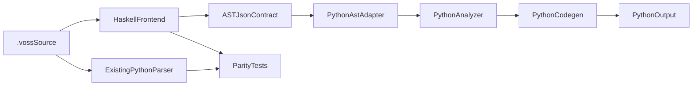

# Haskell Front Half Compiler Plan

## Goal
Add Haskell to the front half of the `.voss` compiler where it has the highest leverage: grammar parsing, AST construction, and eventually typed IR. The first production boundary should be a Haskell executable that emits the same normalized AST JSON contract consumed today by Python tests, CLI, and bridge paths.

## Current Contracts To Preserve
- Parser entrypoint: [`/Users/benjaminmarks/Projects/Voss/voss/parser.py`](/Users/benjaminmarks/Projects/Voss/voss/parser.py) exposes `parse(source, file=...)` and returns Python dataclass AST nodes.
- AST model: [`/Users/benjaminmarks/Projects/Voss/voss/ast_nodes.py`](/Users/benjaminmarks/Projects/Voss/voss/ast_nodes.py) defines frozen dataclasses such as `Program`, `LetStmt`, `IfStmt`, `TypeRef`, and `ConfidenceGate`.
- JSON contract: [`/Users/benjaminmarks/Projects/Voss/voss/ast_serializer.py`](/Users/benjaminmarks/Projects/Voss/voss/ast_serializer.py) emits deterministic `{ "_node": ... }` dictionaries used by golden parser tests and the bridge.
- Grammar source: [`/Users/benjaminmarks/Projects/Voss/voss/grammar.lark`](/Users/benjaminmarks/Projects/Voss/voss/grammar.lark) covers expressions, statements, declarations, budgets, `similar(...)`, `_`, decorators, and newline-sensitive blocks.
- Downstream consumers: [`/Users/benjaminmarks/Projects/Voss/voss/analyzer.py`](/Users/benjaminmarks/Projects/Voss/voss/analyzer.py), [`/Users/benjaminmarks/Projects/Voss/voss/codegen.py`](/Users/benjaminmarks/Projects/Voss/voss/codegen.py), [`/Users/benjaminmarks/Projects/Voss/voss/cli.py`](/Users/benjaminmarks/Projects/Voss/voss/cli.py), and [`/Users/benjaminmarks/Projects/Voss/voss/bridge_server.py`](/Users/benjaminmarks/Projects/Voss/voss/bridge_server.py).

## Architecture
Start with a side-by-side Haskell frontend and a Python adapter. Do not replace the Python parser until the Haskell parser matches the golden AST suite and compile snapshots.

## Phase 1: Contract Lockdown
- Add explicit AST JSON schema documentation under planning/docs, based on current [`/Users/benjaminmarks/Projects/Voss/voss/ast_serializer.py`](/Users/benjaminmarks/Projects/Voss/voss/ast_serializer.py).
- Expand parser golden tests so every syntax family in [`/Users/benjaminmarks/Projects/Voss/voss/grammar.lark`](/Users/benjaminmarks/Projects/Voss/voss/grammar.lark) has normalized AST coverage: literals, expressions, type kwargs, `ctx`, `within`, `match`, decorators, agents, prompts, classes, and `use` aliases.
- Add a Python helper that can reconstruct `ast_nodes.py` dataclasses from the serialized JSON contract. This lets the Haskell frontend feed existing analyzer/codegen without rewriting them immediately.

## Phase 2: Haskell Project Skeleton
- Add a Haskell package in a new workspace directory such as [`/Users/benjaminmarks/Projects/Voss/frontend-hs`](/Users/benjaminmarks/Projects/Voss/frontend-hs).
- Define Haskell ADTs mirroring [`/Users/benjaminmarks/Projects/Voss/voss/ast_nodes.py`](/Users/benjaminmarks/Projects/Voss/voss/ast_nodes.py), including `Span`, expression nodes, statement nodes, declaration nodes, `TypeRef`, `BudgetArg`, and pattern nodes.
- Implement JSON encoding that exactly matches `to_dict(..., normalize_spans=False)` and supports a CLI flag for normalized spans.
- Expose an executable, for example `voss-frontend-hs`, with commands like `ast --path <file> --normalize-spans` and machine-readable parse errors.

## Phase 3: Parser Parity
- Reimplement the `.voss` grammar in Haskell using a parser library suited to newline-sensitive grammars, likely Megaparsec.
- Port critical lexical behavior from [`/Users/benjaminmarks/Projects/Voss/voss/grammar.lark`](/Users/benjaminmarks/Projects/Voss/voss/grammar.lark): composite budget tokens before numbers, `similar` and `_` not tokenized as identifiers in patterns, string escape behavior, comments, and explicit newline separators.
- Match Python parser spans closely enough for non-normalized bridge use, while using normalized goldens as the main cross-platform parity gate.
- Add a parity test runner that compares Python parser JSON and Haskell parser JSON across `samples/`, `voss-demos/`, and `tests/parser/golden/` fixtures.

## Phase 4: Python Integration Behind A Flag
- Add a parser backend selector in [`/Users/benjaminmarks/Projects/Voss/voss/parser.py`](/Users/benjaminmarks/Projects/Voss/voss/parser.py), controlled by an environment variable such as `VOSS_FRONTEND=haskell`.
- Keep default behavior as the Python Lark parser while Haskell remains experimental.
- Route Haskell JSON through the new Python AST adapter so [`/Users/benjaminmarks/Projects/Voss/voss/analyzer.py`](/Users/benjaminmarks/Projects/Voss/voss/analyzer.py) and [`/Users/benjaminmarks/Projects/Voss/voss/codegen.py`](/Users/benjaminmarks/Projects/Voss/voss/codegen.py) continue to receive Python dataclass nodes.
- Extend [`/Users/benjaminmarks/Projects/Voss/voss/bridge_server.py`](/Users/benjaminmarks/Projects/Voss/voss/bridge_server.py) only after the normal `parse()` path supports the backend selector, so CLI and bridge behavior stay aligned.

## Phase 5: Typed IR In Haskell
- Once parser parity is stable, add a typed IR layer in Haskell rather than immediately porting Python analysis.
- Start with pure checks that are natural in Haskell: scope collection, declaration signatures, type references, `probable<T>` gate eligibility, and budget literal normalization.
- Emit typed IR JSON as a separate experimental artifact, not as a replacement for `AnalysisResult` yet.
- Later decide whether to port parts of [`/Users/benjaminmarks/Projects/Voss/voss/analyzer.py`](/Users/benjaminmarks/Projects/Voss/voss/analyzer.py), keeping embedding index generation in Python because it depends on `voss_runtime.semantic` and optional heavy search dependencies.

## Phase 6: CI And Distribution
- Add Haskell CI as a non-release gate first: build `frontend-hs`, run Haskell unit tests, then run Python/Haskell AST parity tests on Ubuntu.
- Avoid npm/PyPI shipping changes until parity is boring and the binary story is clear.
- For release, prefer platform-specific bundled binaries only after evaluating size and platform coverage alongside current npm platform packages and vendored Python packaging.
- Keep subprocess/stdio as the integration model. Do not use Python/Haskell FFI or Rust/Haskell FFI for the first implementation.

## Acceptance Criteria
- `VOSS_FRONTEND=python` remains the default and all existing tests pass unchanged.
- `VOSS_FRONTEND=haskell` passes parser golden parity for normalized AST JSON.
- `VOSS_FRONTEND=haskell python -m voss.cli check samples/` succeeds without analyzer regressions.
- `VOSS_FRONTEND=haskell python -m voss.cli compile samples/classify.voss` produces the same Python output as the Python parser path, except for explicitly accepted formatting or span-only differences.
- CI builds the Haskell frontend and runs parity tests without changing the npm release path.