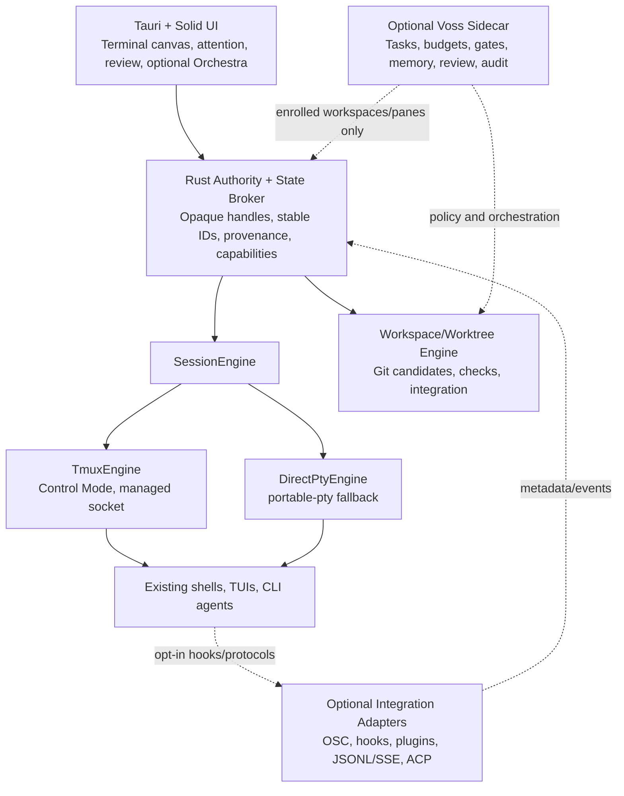

# Voss ADE Deep Dive: Terminal-First, tmux-Powered, Voss-Optional

**Date:** 2026-07-19  
**Scope:** `apps/voss-app`, `crates/voss-app-core`, Voss harness/server/swarm integration, and the current agentic development environment market  
**Research depth:** local code audit, automated test verification, nine focused research tracks, primary documentation, repositories, release notes, issue reports, and targeted user criticism  
**Decision status:** recommended product and architecture direction; tmux fidelity remains gated by a prototype  

## Executive Summary

Voss should become a **terminal-first development environment whose durable process engine is tmux on supported Unix systems and whose Voss capabilities are an optional control plane**. Users must be able to run their existing shells, TUIs, tools, and CLI agents with their existing accounts, configuration, permissions, models, billing, update path, and native interface. Voss should enhance those processes progressively, never replace them as the price of using the terminal.

The current desktop is much further along as an orchestration UI than its older planning documents imply. It already has a substantial terminal grid, agent and activity surfaces, Voss protocol panes, an organization cockpit, board/audit/replay views, and a V25 server-native swarm UI. The critical gap is beneath those surfaces: the live runtime is still one process-local `portable-pty` child per pane. Saved sessions reconstruct shells and old text; they do not preserve running processes. The first P0 containment slices have removed Voss environment injection from ordinary shells, moved automatic terminal state out of repositories, and separated terminal and orchestration command authority; lifecycle controls and external CLI launch contracts remain incomplete.

The market supports a clear direction:

- [tmux Control Mode](https://github.com/tmux/tmux/wiki/Control-Mode) is a proven integration boundary used by iTerm2 for a native GUI client that wants tmux to remain the process/session authority, subject to Voss's xterm/webview fidelity spike.
- [dmux](https://github.com/standardagents/dmux) and [workmux](https://github.com/raine/workmux) demonstrate that tmux plus Git worktrees is a durable, inspectable foundation for parallel CLI-agent work.
- [Paneflow](https://paneflow.dev/docs) documents the clearest neutrality contract among reviewed products: any binary remains a real terminal process, supported agents gain richer state, unknown CLIs still work, and provider auth/network paths remain agent-owned. These runtime claims are primarily first-party.
- [Warp](https://docs.warp.dev/agent-platform/local-agents/overview) demonstrates the value of an excellent terminal plus a separate, powerful orchestration layer, while [recent issue criticism](https://github.com/warpdotdev/warp/issues/9233) provides anecdotal failure-mode evidence for the cost when the agent platform visually or behaviorally dominates the daily terminal.
- [BridgeSpace](https://www.bridgemind.ai/products/bridgespace) provides useful product patterns for a mission tree, shared task board, roles, memory, and command targeting, but its technical and outcome claims are primarily vendor evidence; its own [release ledger](https://www.bridgemind.ai/changelog) is more useful because it exposes real terminal rendering, focus, recovery, and backpressure failures.
- [ACP](https://agentclientprotocol.com/get-started/introduction) and [MCP](https://modelcontextprotocol.io/docs/learn/server-concepts) are valuable optional structured interfaces. Neither replaces the raw PTY/tmux lifecycle contract.

The recommended product has three independent planes:

1. **Terminal plane:** byte-transparent arbitrary command execution, tmux-backed persistence and reattachment, layouts, shells, sessions, notifications, and worktrees. It is complete with Voss off.
2. **Interoperability plane:** opt-in shell integration, CLI adapters, hooks/plugins, JSONL/SSE, ACP, and read-only MCP context. It adds trustworthy status and context while leaving the CLI in control.
3. **Voss plane:** explicitly enabled tasks, roles, budgets, gates, memory, coordination, review, audit, and replay. Orchestra is a projection over durable events, not the owner of ordinary terminal processes.

The immediate priority is not to add more orchestration screens. It is to establish terminal truth, remove involuntary Voss behavior, stop the external-CLI swarm from auto-merging before review, repair build and lifecycle gaps, and prove tmux Control Mode fidelity behind a transport-neutral engine interface.

## Decision

Adopt the following product contract:

> Voss ADE is a complete terminal daily driver with Voss disabled. Any pane can remain an ordinary terminal, gain optional observation, or be explicitly enrolled in Voss management. Closing the desktop detaches from durable sessions; it does not terminate them. Existing CLI agents remain the owners of their accounts, configuration, models, permissions, and TUI.

Implement that contract through:

- a transport-neutral `SessionEngine`;
- a Voss-owned tmux socket and Control Mode backend as the default persistent Unix engine;
- the existing direct `portable-pty` engine as a first-class Windows, missing-tmux, raw, and recovery fallback;
- stable Voss workspace/pane UUIDs bound to mutable tmux and Git identifiers;
- a source-qualified event/state broker;
- a neutral Git candidate, verification, review, and integration pipeline;
- explicit workspace modes: `off`, `observed`, and `managed`.

Do **not** describe the product as tmux-powered until the app actually delegates process/session authority to tmux and passes the fidelity and recovery gates in this report.

## Non-Negotiable Invariants

| Invariant | Required behavior |
|---|---|
| Terminal works without Voss | No Voss credentials, sidecar, environment variables, repo files, prompt changes, Voss service/telemetry calls, or agent adapter are required. An independently configured update check is separate product policy. |
| Arbitrary command baseline | A user can enter any command or explicit argv and receive a normal PTY/TUI. Unknown agents lose metadata, not functionality. |
| Existing CLI ownership | Claude Code, Codex, Gemini, OpenCode, Aider, and future CLIs retain their own auth, settings, models, bills, permissions, MCP config, updates, and native UI. |
| Closing is detaching | App close, webview reload, and app update do not kill tmux-owned processes. Explicit kill remains explicit. |
| Truthful controls | Restart, detach, pause, stop, approve, integrate, and retry appear only when an authoritative backing capability exists. |
| Truthful state | Process facts, terminal facts, agent facts, task facts, attention, and Voss facts are separate and carry source/confidence. |
| No hidden adoption | Hook/plugin installation, sidecar startup, Voss enrollment, cross-pane write, memory creation, and repo-local state each require an explicit user action. |
| Git is integration authority | Agent “done” and terminal idle never mean a change is safe to merge. Evidence is bound to immutable Git state. |
| Repository policy wins | Voss can help satisfy branch protection, checks, and merge queues; it must not bypass or impersonate them. |
| Inspectable escape hatch | A managed tmux session is attachable with normal tmux tooling, and app-local metadata can be exported or diagnosed without the GUI. |

`off` means Voss adds no authority or mutation. It does not sandbox the user's shell or independently configured CLI: raw processes retain the user's normal filesystem and network authority. Opening an observed surface also cannot create `.voss`, edit shell rc files, register MCP, install hooks/adapters, capture sibling panes, export audit data, or start a Voss service.

## Research Method and Limits

The analysis used three evidence layers:

1. Local code and tests in `apps/voss-app`, `crates/voss-app-core`, the Voss harness/server/swarm paths, protocol, and current product/planning contracts.
2. Primary product and technical documentation, repositories, changelogs, standards, and specifications.
3. Issues and community reports used as failure-mode evidence, not as prevalence estimates.

Vendor marketing claims are treated as claims unless supported by technical docs, public code, detailed release history, or independent evidence. BridgeSpace's web demo, for example, explicitly describes itself as a simulation; it is useful for information architecture, not runtime validation.

The local machine did not have tmux installed, so no live Control Mode or reattachment prototype was run. The tmux recommendation is high-confidence as an architecture direction but remains conditional on the fidelity spike defined below.

## Current Voss ADE: What Exists

### Implementation map

| Area | Current implementation |
|---|---|
| Desktop | Tauri 2, Solid 1.9, Vite 8, Tailwind 4, xterm.js 5.5 |
| Terminal | `portable-pty`, one in-process PTY session per pane, Rust-to-webview byte channel, xterm rendering |
| Grid | Binary split tree, pane focus/move/close, presets, workspace tabs, command palette, themes/settings/keymaps |
| Persistence | Private app-data sessions/layouts/agent registries; explicit Voss project data remains repo-local under `.voss` |
| Agent UX | Launch modal, agent sidebar, activity/usage/context, protocol panes, status dots and notifications |
| Voss UI | Overview, Tasks, Agents, Orchestra, Review, Context, Memory, Settings, organization cockpit, board, audit, replay |
| Voss runtime | Python `voss serve` child, loopback bearer auth, REST + SSE, generated TypeScript SDK |
| Swarm | V25 roster/tasks/events, in-process Voss sessions, external CLI roles in worktrees, ownership gates |
| Sandboxing | macOS `sandbox-exec`, Linux `bwrap`, capability downgrade when unavailable |
| Test surface | Rust unit tests, Vitest suites, and Playwright specifications; desktop CI/release wiring is incomplete |

The app/core surface is already large: roughly 58,000 lines across TypeScript, TSX, CSS, and Rust, with terminal and orchestration responsibilities concentrated in `App.tsx` and the Tauri `lib.rs`. This argues for narrowly extracting stable engine boundaries, not rewriting the product.

### Existing strengths to preserve

- The terminal grid is the persistent canvas, while Voss surfaces use canvas swapping instead of destroying the terminal UI.
- Pane sessions survive Solid component remounts within one desktop lifetime.
- Rust has focused PTY lifecycle, resize, foreground-process, backpressure, sandbox, persistence, and registry code with meaningful test coverage.
- The Voss server protocol has explicit versioning, bearer authentication, structured SSE events, permission responses, budgets, confidence, and gates.
- The native Voss paths already model independent reviewers, human approval for critical work, scope-related gates, retry ceilings, and audit sidecars; those controls do not currently govern the arbitrary-CLI merge path.
- V25 provides a server-native coordination plane instead of relying only on filesystem nudges or terminal scraping.
- Product documents already state the correct thesis: the terminal workbench stands alone and Voss is an optional operating layer around managed work.

## Local Audit Findings

### Critical product contradictions

Detailed code paths and verification evidence are recorded in [`00-local-code-audit.md`](research/voss-ade/00-local-code-audit.md); review/security tracks add the external-CLI merge and Tauri/path findings. This table records the audit baseline; the implementation checkpoint below is authoritative for findings already closed on 2026-07-19.

| Severity | Finding | Evidence and impact |
|---|---|---|
| P0 | The terminal is not tmux-powered | Production paths use an in-process `PtyRegistry` and `portable-pty`; no runtime path attaches to tmux. App exit loses live process authority. |
| P0 | “Persistence” is reconstruction | `SessionFile` stores grid state and optional scrollback, not PTY/process identities. Restore starts a new shell. Planning claims about PTY identity surviving reload are false. |
| P0 | Plain shells receive Voss state | Generic `spawn_pty` injects `VOSS_EMBEDDED=1` and `VOSS_AGENT_ID`, contradicting the UI's “Voss injects nothing” promise and the terminal-only requirement. |
| P0 | CLI swarm can merge before review | The arbitrary-CLI runtime stages, commits, merges to the main checkout, marks done, and force-removes the worktree before the native review gates can govern the candidate. |
| P0 | Frontend dependency graph does not build cleanly | The app imports TypeScript SDK source whose `openapi-fetch` and `eventsource-parser` dependencies are not available through the current pnpm workspace/package boundary. |
| P0 | Workspace state can bind to the wrong workspace | One cached SQLite connection is reused after the first workspace; the live Voss server cache can also be reused without verifying cwd. |
| P0 | The webview has excessive native authority | Custom Tauri commands are globally invokable; `get_env_var` returns arbitrary inherited environment values, privileged commands accept caller-provided paths, and no narrow command permission model is defined. A webview compromise can become terminal/host compromise. |
| P0 | Swarm task filenames permit path traversal | `write_swarm_files` joins a caller-provided filename under `.voss/swarm/tasks` without rejecting separators/traversal or authorizing the canonical workspace. |
| P0 | Sidecar bearer authority reaches JavaScript | The token is held in frontend state and sidecar endpoints can accept cwd values beyond an immutable enrolled root. XSS could gain the sidecar's full workspace/memory/swarm authority. |
| P0 | Sandbox labels exceed actual isolation | Current macOS/Linux wrappers mainly restrict writes. They do not credibly protect host-secret reads, network, same-user IPC, or tmux sockets; Windows restricted execution is unavailable. |
| P1 | External CLI command grammar is invented | The launch modal applies shared `--model`, `--cwd`, and task-position arguments to different CLIs that do not share a command grammar. |
| P1 | Visible lifecycle controls are not authoritative | Placement modes are ignored, restart/detach callbacks are empty, and stop can target the pane identifier rather than the transport's PTY session identifier. |
| P1 | Shell selection is presentation-only | Per-pane shell state is persisted/displayed but execution falls back to global `$SHELL`. |
| P1 | Custom agent storage is disconnected | Tauri exposes custom-agent load/save commands, but the launch UI remains hard-coded to five CLIs. |
| P1 | OSC extraction is not streaming-safe | The parser has no carry buffer across PTY reads and does not safely handle fragmented or multiple frames, so metadata can leak or be lost. |
| P1 | Terminal-only use writes `.voss` state | Project structural autosave uses `<workspace>/.voss/session.json`; normal terminal use can mutate a repository merely by opening/splitting panes. |
| P1 | Review is Voss-first, not Git-first | The portal's Review route mounts the organization cockpit rather than a neutral diff/check/candidate/integration surface available to plain shells and arbitrary agents. |
| P1 | Hyperlink actions appear unimplemented | The frontend invokes `open_url` and `open_path`; neither command appears in the Tauri command handler. |
| P1 | Background orchestration failures can disappear | The V25 background swarm driver catches a broad exception and discards it, allowing UI state to become stale without a causal error event. |
| P1 | Sidecar root authorization is weak | Loopback bearer auth exists, but caller-supplied cwd paths are not consistently constrained to an enrolled workspace root. |
| P2 | Release claims exceed repository evidence | No desktop workflow currently runs the Tauri/Rust/Vitest/Playwright matrix, and signing/updater configuration is not demonstrated in the reviewed tree. |
| P2 | Product documentation has drifted | Current surfaces, terminology, release state, process persistence, and old layer boundaries contradict one another. |

### Verification results

- `cargo test -p voss-app-core -p voss-app`: **163 tests passed**.
- `pnpm --dir apps/voss-app test`: **862 tests passed**, but **13 suites failed to import** because the generated SDK dependencies could not resolve.
- `pnpm --dir apps/voss-app build`: **failed** on the same missing dependencies and resulting type errors.
- tmux fidelity/reattach: **not run**, because tmux is not installed locally.
- Packaged Tauri application, signing, updater, OS sandbox, and manual terminal soak: **not verified**.

## Competitive Landscape

### Capability matrix

| Product | Daily-driver base | Arbitrary existing CLIs | Durable terminal authority | Worktree/review | Agent state | Optional orchestration | Main lesson for Voss |
|---|---|---:|---:|---:|---:|---:|---|
| [**Warp + Oz**](https://docs.warp.dev/agent-platform) | Polished proprietary terminal | Yes, with richer support for recognized agents | Warp-owned sessions; not a tmux engine | Worktrees and interactive diff review | Rich for Warp/native and supported CLIs | Strong local/cloud Oz platform | Copy the two-plane value; avoid letting the agent platform take over terminal ergonomics. |
| [**BridgeSpace**](https://www.bridgemind.ai/products/bridgespace) | Native multi-pane terminal workspace | Vendor claims several CLIs | Vendor runtime; recovery details are proprietary | Board/editor/browser; public Git evidence is limited | Rich-looking vendor surface | BridgeBoard + BridgeSwarm + memory | Copy mission tree and targeted direction; trust the changelog more than scale/outcome marketing. |
| [**Paneflow**](https://paneflow.dev/docs) | Native Rust/GPUI terminal workspace | Yes; any binary remains normal | App-owned local PTYs, not tmux | Strong worktree and diff review | Hooks/shims for known agents; honest fallback | Supervision, read-only MCP, JSON-RPC | Clearest documented neutrality model reviewed; runtime claims are primarily first-party. |
| [**dmux**](https://github.com/standardagents/dmux) | tmux TUI | Yes, including plain terminal | tmux | Worktree per task, merge/PR, hooks, file/diff browser | Activity/classifier-based notification | Light coordination | Strong public-code evidence that tmux/worktrees can remain inspectable and agent-neutral. |
| [**workmux**](https://github.com/raine/workmux) | tmux windows/dashboard | Yes, adapter-driven | tmux | Deep lifecycle, diff, checks, merge/rebase/squash/PR | Hook/status-file integrations | Light coordination and messaging | Strong operational model for worktree lifecycle and source-qualified status. |
| [**Flowmux**](https://github.com/grouzen/flowmux) | tmux-oriented overview | CLI-agent focused | tmux | Project/task workflow | Compact agent state/previews | Lightweight dashboard | Early-project evidence; a quiet attention surface can be more valuable than a dominant console. |
| [**Codemux**](https://github.com/Zeus-Deus/codemux) | Terminal/browser/worktree workspace | Presets; structured workflow narrower | Product runtime | Isolated workspaces and review claims | Some heuristic/approximate state | Named phases and agent drill-down | Public code/docs exist, but some marketing outruns documented behavior; never expose estimated state as authority. |
| [**Zed + ACP**](https://zed.dev/docs/ai/agents) | Editor with terminal | Raw terminal plus ACP external agents | Terminal/editor runtime | Git/worktrees | Structured ACP when supported | Agent panel, not fleet orchestration | Keep native, ACP, and raw-terminal modes explicit rather than blending ownership. |
| [**Claude Code teams**](https://code.claude.com/docs/en/agent-teams) | Claude terminal/TUI | No, Claude-specific | Can use tmux/iTerm display | Shared tasks, not general review pipeline | Native team events | Lead/teammates/messages | Experimental and vendor-specific; tmux is a display/process substrate, not durable team authority. |
| [**Voss today**](research/voss-ade/00-local-code-audit.md) | Tauri/xterm grid | Intended, but launch assumptions interfere | Process-local direct PTYs | Voss board plus risky CLI auto-merge | Mixed registry/OSC/Voss sources | Broad Voss-native cockpit | Direct code/test evidence: rich control-plane assets sit above an unready terminal/evidence substrate. |

### What is table stakes

For a terminal-first ADE, the baseline is now larger than split panes:

- faithful raw terminal behavior, alternate screen, mouse/focus, resize, Unicode, clipboard, links, search, and accessibility;
- durable sessions with detach/reattach and crash-aware recovery;
- explicit command, shell, cwd, environment, and restart policy per pane;
- multi-workspace navigation and fast jump-to-attention;
- user-defined arbitrary commands, not only vendor presets;
- worktree creation, setup, branch/base identity, diff, checks, integration, PR, and safe cleanup;
- reliable notifications and honest degraded state for unknown agents;
- a review surface independent of which agent produced the changes;
- privacy, security, update, crash, and diagnostic behavior suitable for a daily driver.

Agent orchestration becomes differentiating only after those foundations are credible.

### What Voss can uniquely add

Voss should not compete by bundling another proprietary coding agent. Its defensible differentiation is an **agent engineering organization layer** that can be attached to heterogeneous terminal work:

- scoped tasks and explicit ownership across agents and humans;
- policy-backed roles rather than role-themed prompts;
- budget, confidence, permission, and scope gates;
- A/B review and human escalation;
- server-native coordination with durable events and replay;
- contextual memory with provenance and controlled sharing;
- evidence-aware integration and audit;
- the ability to promote an ordinary pane/worktree into managed work without relaunching or replacing the CLI.

That value must remain optional. The terminal earns adoption; Voss earns promotion.

## Target Architecture



### Plane 1: Terminal

The terminal plane owns processes, PTYs, sessions, windows, panes, byte streams, resizing, signals, attachment, and terminal snapshots. It knows that a process exists or exited; it does not infer that an agent's work is semantically complete.

Default Unix model:

| Voss concept | tmux concept |
|---|---|
| Managed engine instance | Voss-owned tmux socket/server per trust domain |
| Workspace | One or more tmux sessions bound through stable workspace identity |
| Terminal Group | One attachable tmux topology within one trust domain |
| Terminal tab/surface | tmux window, subject to the fidelity spike |
| Terminal lane | tmux pane |
| Desktop attachment | Control Mode client |

Review, Orchestra, board, browser, editor, and Voss protocol views remain app surfaces outside the tmux topology. tmux panes tile a terminal cell grid; treating arbitrary graphical surfaces as tmux panes would create a false shared geometry and lifecycle model.

The spike must compare two terminal mappings:

1. **One tmux window per terminal tab, multiple tmux panes:** preserves native split topology and the best ordinary-tmux attach experience, but constrains geometry and forbids mixing graphical app panes inside that grid.
2. **One tmux window per terminal leaf:** preserves arbitrary GUI composition but exposes each ADE leaf as a separate tmux window and weakens native tmux split semantics.

Prefer the first only if the product keeps non-terminal surfaces outside the Terminal Group and accepts tmux as the live split authority. Choose from fidelity, recovery, and external-attach results, not visual convenience.

The app should use stable tmux IDs, not display indexes or names, and should store Voss UUID bindings through app metadata and non-secret tmux user options.

### Plane 2: Interoperability

The interoperability plane adds only capabilities the selected source can actually provide:

| Level | Integration | Guarantee |
|---|---|---|
| L0 | Unknown command in raw PTY | Full terminal behavior; process/output/exit facts only |
| L1 | Cosmetic recognition | Name/icon/documentation; no semantic state claim |
| L2 | Shell/terminal semantics | Cwd, prompt/command boundaries, exit status, bell/notification |
| L3 | User-approved hook/plugin/shim | Agent lifecycle, question/permission/turn events where exposed |
| L4 | Agent-owned JSONL or server/SSE | Structured run, tool, usage, session, and resume metadata |
| L5 | ACP client session | Rich external-agent UI with agent-owned auth/config where supported |
| L6 | Voss MCP capability | Optional Voss context/tools available to an existing agent |
| L7 | Voss-managed pane/task | Budgets, gates, roles, coordination, audit, and review authority |

The names should not reuse the app's security capability tiers. Integration richness and sandbox authority are different dimensions.

### Plane 3: Voss

The Voss plane starts only after explicit enrollment. It consumes the same workspace, pane, Git candidate, and state records as the terminal UI. It may observe or manage selected resources, but does not become the PTY owner for arbitrary agents.

Workspace modes:

| Mode | Voss process | Allowed behavior |
|---|---|---|
| `off` | Not started | Full terminal, workspaces, worktrees, diff, checks, review, and Git integration |
| `observed` | No Voss sidecar required | App-local, user-approved status/context adapters, history, notifications, and specifically granted read-only context; no policy control |
| `managed` | Workspace-bound sidecar | Tasks, roles, budgets, gates, memory, coordination, reviewer policies, audit/replay |

Switching from `managed` to `off` detaches the sidecar and disables managed controls; it does not kill the tmux panes or third-party agents.

“Managed” is an integration mode, not a blanket claim that Voss controls an opaque process:

| Attached runtime | What Voss may truthfully control |
|---|---|
| Opaque existing CLI/TUI | Organize task/pane/worktree bindings, observe terminal/process facts, gate candidate integration, record decisions; no hard model/tool budget, permission, semantic pause, or filesystem enforcement |
| Cooperative hook/plugin/ACP/server | Only the negotiated lifecycle, messaging, usage, permission, resume, and tool capabilities exposed by that adapter/version |
| Voss-launched restricted/native run | Only budgets, filesystem/network scope, tools, and gates actually enforced by the launch boundary and OS/runtime policy |

A direct-PTY process cannot be moved live under tmux ownership. Non-disruptive Voss attachment applies to a pane that is already owned by the selected durable engine; migrating an existing direct pane requires an explicit restart/reconstruction and must not be called reattachment.

## tmux Engine Design

### Why Control Mode

tmux already owns the hard lifecycle boundary: a server retains PTYs and child processes while clients detach and reattach. Control Mode provides framed command replies, asynchronous topology notifications, pane output, stable pane identifiers, format subscriptions, flow-control signals, and recovery through `capture-pane`. It was created for native clients such as [iTerm2's tmux integration](https://iterm2.com/3.3/documentation-tmux-integration.html).

Voss should use an isolated socket namespace and a minimal generated config rather than implicitly attaching to or modifying the user's normal tmux server. A separate explicit “Attach existing tmux” path can connect to a chosen user socket.

The private socket is a determinism boundary, not a sandbox: access to a tmux socket effectively grants control over every process in that server. Place it in a user-only runtime directory, verify ownership/mode before connecting, never expose it through the webview, and do not store secrets in tmux options. Existing-server mode must explain that Voss and other attached clients share full control.

Do not place a restricted managed agent in the same reachable tmux server as raw trusted shells and then claim pane-level isolation. A workspace may visually compose multiple Terminal Groups/security domains:

- trusted raw shells can share a workspace tmux server;
- related agents with the same authority can share a named trust-domain server;
- high-risk restricted agents use a dedicated server or equivalent domain whose socket is not reachable from the child;
- attaching an existing user tmux session is compatibility mode and grants Voss full control of that server.

Unsetting `$TMUX` is not sufficient isolation because a same-user process may discover socket paths. The OS policy must make the socket unreachable. Cross-domain read/write happens only through explicit app-mediated capabilities.

Define a multi-client size policy. tmux derives window size from attached clients and can use smallest/largest/latest/manual policies; an ordinary external attach can otherwise resize or viewport-crop the ADE unexpectedly. The managed default should keep one sizing authority while making external clients' viewport behavior explicit.

Expose two tmux profiles with different support promises:

- **Managed-safe:** isolated Voss socket, audited minimal config, no automatic third-party plugins, patched/capability-probed tmux, deterministic rendering and security baseline.
- **Compatibility:** selected user server/config/plugins, treated as trusted code; broader habit compatibility but weaker reproducibility and isolation claims.

Initial beta ships managed-safe only. Existing-user-server import follows after engine stability because it introduces arbitrary plugins/config, full-server authority, and external topology writers.

### Engine boundary

The Rust core should expose typed operations and events rather than tmux command strings:

```rust
trait SessionEngine {
    fn capabilities(&self) -> EngineCapabilities;
    async fn create_or_attach(&self, spec: SessionSpec) -> Result<SessionHandle>;
    async fn spawn_pane(&self, target: SurfaceId, spec: SpawnSpec) -> Result<PaneId>;
    async fn write(&self, pane: PaneId, bytes: &[u8]) -> Result<()>;
    async fn resize(&self, target: ResizeTarget, size: CellSize) -> Result<()>;
    async fn signal(&self, pane: PaneId, signal: Signal) -> Result<()>;
    async fn snapshot(&self, pane: PaneId) -> Result<PaneSnapshot>;
    async fn detach(&self, session: SessionId) -> Result<()>;
    async fn kill(&self, pane: PaneId) -> Result<()>;
    fn subscribe(&self, session: SessionId) -> EventStream;
}
```

Typed events should include output, snapshot, exit, topology, focus, title, cwd, lag/desync, engine disconnect, and recovery. Solid components should never parse tmux protocol text or own live process identity.

### Fidelity gate

Before migrating the default backend, build a standalone Rust spike and a deterministic terminal torture fixture. The gate must prove:

- initial attach and reattach hydrate the same visible state;
- normal and alternate screens restore correctly, while `capture-pane` is treated only as a repair source rather than proof of complete emulator state;
- cursor position, wrap, Unicode width/combining/emoji, attributes, truecolor/styled underline, title, focus, bracketed/large paste, mouse modes, and resize remain correct;
- arbitrary UTF-8, IME input, Kitty keyboard sequences, and byte-oriented input preserve ordering;
- `Ctrl-C`, signals, job control, foreground process, and shell exit semantics match direct PTY behavior;
- OSC clipboard, notifications, bells, hyperlinks, passthrough, and supported image protocols fail safely and predictably;
- `TERM`/terminfo negotiation, synchronized output, DCS passthrough, SIXEL/Kitty graphics, copy/search/selection, nested tmux, and tmux-in-pane behavior are tested or explicitly unsupported;
- multiple panes can stream heavily without starving focused input;
- flow-control pause/continue and `capture-pane` recovery do not lose or duplicate output;
- GUI detach leaves processes alive and ordinary `tmux -L <socket-name> attach-session -t <session>` or `tmux -S <socket-path> attach-session -t <session>` can inspect them;
- external attachment and client-size changes reconcile predictably;
- new panes receive an explicit fresh environment rather than a stale tmux-server snapshot;
- renderer lag is detectable independently from process liveness.

If Control Mode fails this gate, retain `DirectPtyEngine` as default while deciding between a custom mux daemon, Zellij adapter, or narrower tmux integration. Do not paper over fidelity failures with scrollback replay.

### Persistence and recovery

Maintain three different records:

1. **Workspace template:** declarative, optional/shareable desired layout and startup commands.
2. **Workspace snapshot:** local durable Voss UUIDs, tmux/Git bindings, last presentation state, and restart policies.
3. **Observed runtime:** current tmux sessions/panes/processes and Git/worktree facts.

Recovery order is:

1. reattach to live tmux resources;
2. reconcile Git worktrees and durable bindings;
3. show missing/orphaned/conflicted resources honestly;
4. offer confirmation-gated reconstruction only for resources that no longer exist.

Never silently rerun arbitrary saved commands after reboot or tmux-server loss.

## Security and Trust Architecture

tmux is the durability substrate, not the security boundary. The [tmux FAQ](https://github.com/tmux/tmux/wiki/FAQ) is explicit that socket access implies full trust. Likewise, Tauri's Rust core has host authority and the webview reaches it through IPC; capability declarations do not replace validation inside each privileged command ([Tauri security model](https://tauri.app/security/), [Tauri capabilities](https://v2.tauri.app/security/capabilities/)).

### Threat model

Protect:

- terminal input, scrollback, clipboard, titles, links, and pane content;
- workspace/Git state, hooks, remotes, candidates, and release artifacts;
- SSH/cloud/provider credentials, keychains, environment values, and agent sockets;
- tmux control sockets and Voss sidecar tokens;
- update/signing keys and remote-host identity.

Assume potentially malicious repositories, terminal programs, remote hosts, agents, MCP servers, plugins/hooks, dependencies, and webview content. Raw unmanaged shells intentionally have the user's normal authority; the product must not imply otherwise.

### Rust-owned authority handles

The frontend receives opaque IDs and presentation data, not arbitrary privileged coordinates:

```text
WorkspaceHandle -> canonical local/remote root + trust decision
TerminalHandle  -> backend + trust domain + workspace + engine-owned session ID
AgentHandle     -> terminal + adapter + grants + managed policy
VossHandle      -> workspace + Rust-held sidecar token + lifecycle
RemoteHandle    -> SSH config host + verified host-key identity + connection
```

After creation, privileged commands derive canonical paths, sockets, processes, and base URLs from these handles. The webview does not supply arbitrary absolute paths, environment-variable names, tmux sockets, PTY IDs, sidecar tokens, or server URLs.

P0 hardening:

- define narrow Tauri command permissions and enforce ownership/scope in Rust;
- remove arbitrary `get_env_var`; expose typed non-secret capability probes;
- replace caller-selected swarm filenames with Rust-generated task IDs and directory-relative, symlink-safe writes;
- authorize and canonicalize every workspace/worktree path;
- keep sidecar tokens in Rust and proxy typed operations instead of giving JavaScript bearer credentials;
- reduce production CSP/network origins and keep remote/HTML content outside the privileged terminal webview;
- bind PTY write/kill/signal operations to the owning workspace/pane handle.

### Sidecar boundary

Preserve the current loopback, random bearer, parent-death, and no-token-log controls. Strengthen them:

- one immutable canonical root per sidecar;
- no arbitrary cwd on memory/session/swarm endpoints;
- reject every derived path outside the enrolled root;
- Rust-held token, per-workspace rotation/revocation, and no token in logs, URLs, tmux env, crash data, or persistence;
- separate development and production origin policies;
- explicit start on managed action and explicit stop/detach semantics.

### Honest execution profiles

| Profile | Files/network/credentials | tmux and cross-pane | Product claim |
|---|---|---|---|
| Raw terminal | User's normal authority and environment | Trusted/raw domain | “Normal shell” |
| Unmanaged CLI agent | Agent has the user's OS authority and its own auth | No Voss grant, but not OS-isolated | “Not isolated” |
| Managed agent | Canonical workspace policy, minimal/brokered credentials, explicit network | Isolated tmux trust domain and audited grants | “Restricted” only when kernel policy passes |
| Voss-native run | Managed OS policy plus typed Voss API | Audited workspace/task grants | “Orchestrated” |

Current `sandbox-exec`/`bwrap` policies should be labeled best-effort write containment. They do not presently justify confidentiality, network, credential, or cross-pane isolation claims. A requested restricted run should fail closed or require explicit downgrade acceptance; it should not silently continue as if protection were equivalent.

Linux restricted mode needs audited namespaces, `--new-session`, default-deny network, minimal devices, private temp, no credential/tmux sockets, and resource limits. macOS `sandbox-exec` is deprecated and should remain defense-in-depth while a container/VM-backed high-assurance mode is evaluated. Native Windows remains ConPTY/unmanaged unless a separately tested AppContainer/WSL/remote policy ships.

### Terminal and context security

[xterm.js security guidance](https://xtermjs.org/docs/guides/security/) treats terminal output and browser integration as mutually sensitive. Implement:

- bounded incremental parsing and fuzz corpora for tmux frames, UTF-8, OSC, DCS, malformed/oversized/fragmented input;
- deliberate hyperlink activation and allowlisted schemes;
- OSC 52 clipboard off or tightly policy-controlled, especially for remote/untrusted panes;
- terminal titles/paths/URLs rendered as text and independently validated before native actions;
- per-pane sensitive/private flag that disables persistence, context export, model access, and notifications containing content;
- persisted scrollback off by default or owner-only encrypted/app-data storage with retention and deletion controls;
- no automatic action, approval, or memory promotion based only on terminal output.

MCP roots are intent, not enforcement. Use OS/path enforcement, validate token audience, reject token passthrough, treat tool descriptions and pane contents as untrusted, and keep read versus mutation tools separate ([MCP security best practices](https://modelcontextprotocol.io/docs/tutorials/security/security_best_practices)).

### Remote model

First remote release: delegate transport and identity to the user's OpenSSH client.

1. Resolve the SSH config host and enforce normal `known_hosts` verification.
2. Probe remote tmux without modifying the host.
3. Ask before installation or rcfile changes; decline falls back to a normal SSH terminal.
4. Attach to an app-namespaced remote tmux Control Mode session.
5. Bind saved state to SSH alias, remote user, and verified host-key fingerprint.
6. Reconnect after network loss without interpreting disconnect as process death.

Defaults: no SSH agent/X11/port forwarding, no remote indexing/capture, no OSC clipboard, and no Voss sidecar. If remote orchestration is enabled, run the sidecar on remote loopback and tunnel only its ephemeral port; keep the token in local Rust. OpenSSH remains the owner of host keys, hardware keys, ProxyJump, and authentication ([OpenSSH](https://www.openssh.org/)).

### Distribution and privacy

Before public beta:

- CI must build/test Rust, TypeScript, Playwright, Tauri, and the platform webview matrix;
- sign and notarize macOS builds, sign Windows builds, and sign updater artifacts according to [Tauri distribution guidance](https://v2.tauri.app/distribute/);
- define schema migration, updater rollback, advisory response, dependency/SBOM, and release-ledger processes;
- validate or bundle a patched tmux build and record supported features;
- keep terminal use account-free and local;
- keep analytics/crash reporting off by default;
- exclude prompts, terminal content, environment, paths, tokens, and memory from diagnostics unless a user explicitly reviews and includes them.

## Workspace and Worktree Model

A useful workspace is a durable task envelope, not a terminal tab. It may bind five independently recoverable resources:

1. user-facing workspace identity;
2. optional repository/checkout/worktree;
3. tmux session/window/panes;
4. ordinary CLI processes;
5. optional observation or Voss orchestration state.

Recommended domain objects:

| Object | Required identity/state |
|---|---|
| `Project` | Stable UUID, canonical Git common dir, remotes fingerprint, default target |
| `Workspace` | Stable UUID, name, project/template binding, lifecycle, orchestration mode |
| `CheckoutBinding` | Main/linked/external/none, path, branch, base/head SHA, ownership, setup/cleanup state |
| `TmuxBinding` | Engine/socket/session IDs, last-seen runtime, attachment and recovery state |
| `Surface` | Terminal/review/files/browser/orchestration kind, tmux window binding, presentation order |
| `Pane` | Stable UUID, tmux/direct ID, cwd, explicit launch spec, restart policy, adapter capability |
| `PortLease` | Workspace/service/host/port, allocation source, active/released state |
| `Operation` | Transaction intent, phase, inputs, result, causal error, timestamps |

Paths, branch names, tmux names, pane indexes, and agent session IDs are bindings, never primary keys.

### Transactional worktree lifecycle

The engine should model worktree operations as recoverable transactions:

`requested -> validating -> creating -> bootstrapping -> ready -> candidate_ready -> integrating -> integrated -> cleanup_eligible -> removed`

Each stage records its inputs and causal failure. Setup hooks run explicitly and stream into normal terminal jobs. Port, container, database, cache, and environment collisions are surfaced because worktrees isolate files, not external services.

Support:

- existing main checkout, Voss-managed linked worktree, adopted external worktree, or no Git checkout;
- selectable base/target branch and base SHA;
- bootstrap hooks with logs and retry;
- deterministic or configured port leasing with availability checks;
- ahead/behind, dirty, untracked, unpushed, locked, prunable, and repair state;
- merge, rebase, squash, stacked target, or PR handoff;
- keep-after-integration by default until verification completes;
- cleanup as a separate explicit/recoverable action.

[Git's worktree commands](https://git-scm.com/docs/git-worktree.html) remain the authority for list, lock, move, repair, remove, and prune behavior.

## Attention and State Model

When many terminals run concurrently, the scarce resource is human attention. The primary supervision feature is not a large graph; it is a quiet answer to:

1. Which session needs me?
2. Why?
3. What exact pane should receive focus?

Do not overload one `status` field. Separate:

| Dimension | Examples | Authority |
|---|---|---|
| `PaneHealth` | connected, desynced, renderer-lagging, detached, lost | session engine/renderer |
| `TerminalState` | shell-ready, command-running, output-active, quiet, exited | tmux/PTY + optional shell integration |
| `AgentState` | working, awaiting-answer, awaiting-permission, stopped, failed | explicit hook/plugin/protocol only; inferred variants labeled |
| `TaskState` | unassigned, active, candidate-ready, under-review, blocked, complete | workspace/Voss task authority |
| `AttentionReason` | request, permission, failure, completion-to-review, renderer problem | derived from sourced transitions |
| `ReadState` | unseen, seen-in-list, visited-source, acknowledged | UI/user behavior |

Every normalized event should include `source`, `source_version`, `confidence`, `observed_at`, `workspace_id`, `pane_id`, and an optional external session/run ID.

Priority should be deterministic: security/permission request, renderer/process failure, user question, candidate ready for review, completion, background informational event. Completion remains unread until the user visits or acknowledges it; merely focusing the app should not clear every event.

Daily-driver UX should include:

- unread/error filters and a compact attention inbox;
- focus-aware in-app and native notifications;
- “next pane needing attention” and “previous attention” commands;
- deep link from every event to its pane, task, candidate, or evidence record;
- parent-level notification aggregation for managed multi-agent runs;
- rate-limited OSC/application notifications;
- explicit “inferred” labels for heuristic status;
- renderer lag and stale attachment as first-class warnings.

Warp's [agent notifications](https://docs.warp.dev/agent-platform/capabilities/agent-notifications/), workmux's status dashboard, and Paneflow's known/unknown agent split all support this model. BridgeSpace's changelog demonstrates why renderer health cannot be conflated with process or agent health: processes continued running while panes appeared blank or partial under heavy output.

## CLI Adapter Strategy

### Raw command first

Replace the hard-coded universal launch grammar with an explicit `SpawnSpec`:

```text
program
argv[]
cwd
env additions/removals
shell wrapping = never | user-selected
restart policy
adapter id?          # optional metadata, never required to execute
```

The command editor should show the exact executable and argv that will run. A user-created command is first-class. Presets are conveniences that resolve through versioned adapter code and can always be edited before launch.

### Adapter registry

An adapter declares:

- executable/path/wrapper matching and nonblocking version probe;
- launch, resume, attach, and headless templates independently;
- supported observation methods: process, OSC, hook, plugin, JSONL, server/SSE, ACP;
- exact events/capabilities available for the detected version;
- owned configuration files and a reversible install/uninstall manifest;
- permission/trust steps and whether config changes are user- or project-scoped;
- whether the adapter can observe, message, stop, resume, or manage the session;
- fallback behavior when detection or the richer channel fails.

Do not silently edit `~/.claude`, `~/.codex`, Gemini, OpenCode, shell startup, MCP, or provider config. Adapter setup is explicit, previewable, attributable, reversible, and independently disableable.

### Standards

- **OSC 7/133 and shell integration:** useful for cwd, prompt/command boundaries, command navigation, and exit status. It is not agent semantic truth.
- **Agent hooks/plugins:** best way to add lifecycle status while preserving the native TUI, but vendor-specific and version-sensitive.
- **JSONL/server-SSE:** strong for structured headless or agent-owned server modes. Present as a separate session type rather than pretending it is the raw TUI.
- **ACP:** strong optional client mode for external agents. Follow [Zed's explicit separation](https://zed.dev/docs/ai/agents) between native, ACP external, and terminal agents.
- **MCP:** use to expose optional Voss resources/tools to an existing agent. Default cross-pane context should be read-only; MCP is not the process/session engine.

### Cross-pane access

Use separate capabilities:

- list pane metadata;
- read bounded recent output;
- search output;
- read Git candidate/evidence;
- request user focus;
- send text/input;
- send control bytes/signals;
- create/kill panes.

Unknown and unenrolled CLIs receive no cross-pane grant. After explicit enrollment, bounded read-only inspection is the least-privileged bridge: it remains workspace/target-scoped, attributed as untrusted content, and disabled for secret/private panes. Writing or signaling another pane is a separate high-risk permission and should never be implied by read access.

## Neutral Review and Integration Plane

The universal workflow is:

`candidate revision -> scoped diff -> verification -> review -> approval/policy -> integration -> aggregate verification -> cleanup`

Git state, not agent prose or terminal idleness, is authoritative.

### Durable records

```text
Candidate
  id, workspace_id, repo_id, worktree_id, current_revision_id

CandidateRevision
  id, candidate_id, base_sha, head_sha, tree_oid, diff_summary,
  dirty_state, created_at

Verification
  id, candidate_revision_id, command, cwd, source, exit_code,
  started_at, ended_at, log_ref, artifact_refs, environment_fingerprint?

Review
  id, candidate_revision_id, reviewer_kind, findings[], disposition

Approval
  id, candidate_revision_id, principal, scope, decision, reason

GateEvaluation
  id, candidate_revision_id, evidence_refs[], policy_version, decision, reason

Integration
  id, candidate_revision_ids[], target_ref, expected_target_sha,
  strategy, result_sha?, repository_status, result
```

A commit SHA alone cannot identify a dirty candidate containing staged, unstaged, or untracked changes. Materialize every reviewable state into an immutable Git tree using a temporary index, then bind evidence to a `CandidateRevision`/`tree_oid` without modifying the user's index. Any candidate mutation creates a new revision and marks verification, review, approval, and gate evidence for the previous revision stale.

### Review surface

Review must work for a plain shell with Voss off:

- project, multi-project, branch, and sibling-worktree scope;
- changed file list, split/unified diff, untracked files, base selector, binary/size limits with honest truncation;
- hunk/file/all revert and optional staging;
- local verification commands with captured output and artifacts;
- remote CI/check and PR state shown separately from local checks;
- portable line comments bound to candidate revision and blob/line identity;
- open a plain terminal or selected CLI in the candidate worktree;
- prefill review instructions but never auto-submit them to a third-party TUI;
- integrate/PR/keep/cleanup as distinct actions.

Voss Review is an explicit secondary action on the same candidate. It can run A/B reviewers, confidence and budget policies, human gates, retry rules, and audit, but its output remains one evidence source. Repository branch protection and merge queues remain final authority.

### Required correction to CLI swarm

End external CLI work at `candidate_ready`. Preserve the worktree and branch and emit base/head SHAs, immutable candidate tree/revision, changed paths, scope result, logs, and claimed result. Build an ephemeral aggregate integration worktree, merge selected candidate revisions in dependency order, run combined verification, review the combined tree, then integrate explicitly. Never mark a task complete and destroy the candidate immediately after an agent exits.

## Optional Orchestration Console

### Product role

Orchestra is a user-opened projection over durable terminal, task, worktree, event, evidence, and policy state. It is not the default home, a replacement terminal, or a source of invented process control.

The most useful console views are:

1. **Attention:** requests, failures, approval, candidate review, and stale/lost resources.
2. **Task graph:** objective, dependencies, ownership, scope, status, and current candidate.
3. **Agent roster:** actual pane/session binding, capability source, role policy, cost/budget where authoritative.
4. **Timeline/replay:** append-only normalized events with provenance and causal links.
5. **Evidence:** diffs, checks, review findings, approvals, artifacts, and integration attempts.
6. **Targeted direction:** explicit `@pane`, `@role`, `@task`, and `@all`, with delivery acknowledgement and failure state.

The visual mission tree from BridgeSpace is worth adopting only when every edge is backed by a real task/session/event relationship. Voss's existing no-fake-signal principle should remain strict.

### Attach and promotion

A user should be able to:

- run any CLI normally;
- optionally identify or attach a richer adapter to the existing pane;
- create a neutral task/worktree association without starting Voss;
- enable observation for selected events;
- promote the pane/workspace/candidate into Voss management;
- detach Voss management while leaving the process alive.

Promotion records a binding; it does not stop the shell and replace the user's process with a proprietary client.

### Authoritative controls

For each visible action the adapter/engine must declare:

| Action | Minimum authority |
|---|---|
| Focus/open | Pane binding exists |
| Notify/acknowledge | State broker owns read state |
| Send message/text | Explicit input capability and user grant |
| Interrupt/stop | Session-specific signal/control capability |
| Pause/resume | Real agent or scheduler protocol; terminal flow-control pause is not agent pause |
| Restart | Reconstructable launch spec and explicit restart policy |
| Reassign | Task authority plus compatible destination |
| Approve | Named policy/repository principal |
| Integrate | Fresh Git candidate and target preconditions |
| Kill all | Explicit managed membership plus per-resource result reporting |

Unknown, approximate, or unsupported controls are omitted, not stubbed.

## Context, Memory, and Communication Boundaries

Context should be separated by ownership and lifetime:

| Layer | Examples | Default storage/sharing |
|---|---|---|
| Terminal/session context | Recent output, cwd, command marks, process state | Local app/tmux state; bounded and private |
| Task context | Objective, constraints, worktree, diff, evidence, messages | Workspace database; share only with task members |
| Project knowledge | Architecture, commands, conventions, decisions | Explicit project files or indexed resources; reviewable |
| User memory | Preferences, habits, cross-project notes, secrets references | Private user store; never committed implicitly |
| Orchestration audit | Events, gates, assignments, approvals, integrations | Managed Voss store; append-only/provenance-rich |

Do not put all five into one `.voss` or “memory” bucket. Repository-local knowledge can be useful and commit-worthy, but creation and agent read/write access must be explicit. Managed enrollment keeps audit app-local by default; exporting/shareable audit or evidence into the repository is a separate previewed action. Terminal snapshots, prompts, user-private memory, adapter state, credentials, and raw audit history never enter a repo implicitly.

Inter-agent communication should be structured and scoped when managed: task message, sender, recipient, correlation/causation ID, acknowledgement, visibility, and attachment references. For arbitrary CLI agents without a structured channel, the fallback is a user-approved paste/input action or a durable prompt file, not covert terminal injection.

After a user explicitly grants cross-pane context, read-only pane inspection is the correct default bridge. Treat all pane and memory content as untrusted data, preserve source references, bound payload size, and keep instruction authority separate from retrieved content.

## Feature Recommendations

### Must ship for terminal credibility

- `SessionEngine` boundary with capability-driven UI.
- tmux Control Mode fidelity spike and managed-socket backend on supported Unix.
- direct PTY fallback, clearly labeled ephemeral across app exit.
- true detach/reattach, import existing tmux, recovery diagnostics, and plain tmux escape hatch.
- explicit per-pane program/argv/cwd/env/shell/restart policy.
- arbitrary custom commands as first-class launch entries.
- byte-stream and OSC streaming parsers with fuzz/property tests.
- renderer/backpressure/desync health and rehydration.
- app-data storage for private runtime state; no `.voss` creation in terminal-only mode.
- workspace-bound registries and sidecars.
- working open-link/path, placement, detach, restart, stop, and shell-selection behavior.
- reliable frontend build/test dependency boundaries and desktop CI.

### Must ship for an agentic daily driver

- source-qualified attention broker and inbox with jump-to-pane.
- adapter registry with reversible setup and honest degradation.
- shell integration for cwd/command boundaries as an opt-in enhancement.
- transactional worktree lifecycle, bootstrap logs, port/service isolation metadata, repair, and safe cleanup.
- Git-native diff/check/review/integration surface available with Voss off.
- immutable-revision-bound candidates, verification, reviews, approvals, and integration attempts.
- configurable verification commands and imported repository/CI status.
- read-only cross-pane context API with sensitive-pane exclusion.
- session/task/worktree/pane binding and resume diagnostics.

### Voss differentiators

- explicit `off | observed | managed` workspace mode.
- attach/promote/detach existing panes without relaunching the CLI.
- task graph, enforced ownership, role capability policy, and targeted direction.
- budgets, confidence, permissions, scope gates, and human escalation.
- A/B review over neutral Git candidates.
- aggregate/fan-in verification and integration audit.
- provenance-rich event timeline and deterministic replay.
- layered project/task/user memory with controlled MCP exposure.
- managed remote or cloud execution later, using the same task/evidence model.

### Deliberately later

- Native Windows persistent daemon or Zellij backend.
- Remote tmux over SSH as a first-class GUI domain.
- Hosted execution, organization fleet, schedules, and triggers.
- Monaco-class editor/LSP ambitions beyond the review and inspection loop.
- Automatic semantic classification of unknown terminal output.
- Large-swarm visual spectacle or swarm-count marketing.

## Phased Roadmap

The phases are ordered by trust dependency. Existing orchestration surfaces may remain available during the work, but new feature investment should follow this sequence.

### Phase 0: Make current claims true

**Goal:** A reliable direct-PTY terminal whose Voss-off boundary, controls, build, workspace binding, and Git safety are honest.

Work:

- remove Voss environment injection from generic shells and add a regression test asserting the complete neutral spawn environment;
- move private terminal/workspace/session state to app data; make repo-local `.voss` creation explicit;
- replace shared CLI flags with raw editable commands and adapter-specific argv builders;
- wire or remove placement, shell, hyperlink, restart, detach, and stop controls;
- key registries and live servers by stable workspace identity and canonical cwd;
- make OSC/metadata parsing incremental, bounded, and tested across arbitrary chunk boundaries;
- repair the pnpm SDK package boundary so clean install, typecheck, test, and build pass;
- surface background V25 failures as terminal events with cause;
- enforce sidecar roots for every cwd-bearing endpoint;
- replace arbitrary webview paths/env access with Rust-owned opaque handles and scoped Tauri commands;
- fix swarm task filename traversal and add separator/symlink/adversarial path tests;
- keep sidecar tokens out of JavaScript and narrow the production CSP/origin surface;
- relabel current sandbox profiles as write containment until stronger isolation is demonstrably enforced;
- stop CLI swarm execution at `candidate_ready`; remove automatic merge/force-cleanup from the run path;
- publish one code-linked capability matrix: shipped, partial, prototype, proposed, and not verified.

Exit gates:

- clean frontend build and all Rust/TS tests pass;
- terminal-only launch performs no Voss network, environment, repo write, or sidecar action;
- every visible pane/agent control has an integration test against the actual session ID;
- external CLI output remains in a preserved worktree/candidate until explicit integration;
- two workspaces cannot share the wrong registry or server;
- manual 24-hour direct-PTY terminal soak passes common shells, editors, pagers, SSH, REPLs, TUIs, and CLI agents.

**Implementation checkpoint (2026-07-19): Phase 0 remains in progress.**

Closed in the first containment slice:

- generic shell sessions strip inherited `VOSS_*` state and no longer receive `VOSS_EMBEDDED` or `VOSS_AGENT_ID`;
- the TypeScript SDK is part of the pnpm workspace with declared runtime dependencies; the production app build and full frontend test suite pass;
- agent registries are isolated by stable workspace ID, and sidecar processes are keyed by canonical registered project root;
- the unused arbitrary environment-read and swarm-file-write Tauri commands were removed, eliminating that task-filename traversal path;
- external CLI work is committed to a preserved `candidate_ready` branch/worktree/head, never auto-merged or force-cleaned, and a retry cannot erase an existing candidate;
- candidate events now flow through Python contracts, the generated Rust SDK, server SSE adaptation, and the Solid live store.
- sidecar bearer tokens, loopback ports, base URLs, and canonical roots now remain in Rust; JavaScript receives only an opaque sidecar ID and uses an allowlisted operation proxy plus Tauri-channel SSE forwarding;
- the production CSP no longer permits arbitrary localhost ports or direct Anthropic connections from the webview.
- every registered application command is now opt-in through Tauri's generated command manifest; the `main` terminal window has no Voss sidecar or run-review permissions, while the separate optional `orchestration` window has no PTY or agent-process-spawn permissions;
- Review, Orchestra, Memory, and Ask Voss entry points open the orchestration window explicitly; Voss sidecar commands also enforce the invoking window label in Rust, and Review derives its canonical workspace root from Rust-held console context rather than renderer-supplied paths.
- project sessions, named layouts, and live agent registries now persist under `~/.config/voss-app`, keyed by stable workspace ID; normal project open and structural terminal autosave no longer create `.voss`;
- valid legacy `.voss/session.json` and `.voss/layouts/*.json` files are copied once into private app state without modifying or deleting the originals; legacy agent registries are intentionally not copied because their process records are ephemeral and may be stale;
- renderer session/layout commands carry workspace IDs rather than filesystem paths, and Rust derives any legacy-read path from the persisted workspace index.

Still open before the Phase 0 exit gate: raw custom launch contracts, real control wiring, incremental OSC parsing, background failure events, honest sandbox labels, the capability matrix, cross-session neutral-mode tests, and the manual terminal soak. The terminal and orchestration renderers now have separate command authority; remaining privileged commands still require their own argument validation and opaque-handle migration as their surrounding P0 work lands.

### Phase 1: Extract engine boundaries and prove tmux

**Goal:** Introduce `SessionEngine` without changing user behavior, then validate Control Mode independently.

Work:

- adapt the current PTY registry behind `DirectPtyEngine`;
- move session identity and capability decisions out of Solid components;
- define typed engine operations/events and stable workspace/surface/pane identities;
- implement a streaming tmux Control Mode codec and state reconciler in an isolated Rust module;
- model tmux servers as trust domains and test socket invisibility from restricted child processes;
- build the terminal torture fixture and deterministic attach/reattach tests;
- test Voss-owned socket, ordinary tmux attach, external client sizing, crash/disconnect, backpressure, and snapshot recovery;
- benchmark focused-input latency and multi-pane throughput against direct PTY.

Exit gate: the fidelity matrix passes or produces a written no-go decision. No broad UI migration occurs before this result.

### Phase 2: Persistent tmux engine beta

**Goal:** App close becomes detach and restart becomes reattach on supported Unix hosts.

Work:

- ship `TmuxEngine` behind an opt-in setting and capability probe;
- create/attach/reconcile Voss-managed sessions, windows, panes, and user-option bindings;
- implement snapshot hydration, flow-control recovery, renderer health, and engine diagnostics;
- persist templates, snapshots, and runtime bindings separately;
- retain direct PTY as Windows/fallback/raw mode;
- add crash, update, socket loss, orphan, server loss, and reboot recovery flows.
- package the local beta with desktop CI, signing/notarization, signed updater artifacts, rollback, and migration tests;
- defer existing-user-tmux import to a post-beta subphase after the managed-safe socket is stable.

Exit gates:

- closing/killing the GUI leaves a long-running process and full-screen TUI alive;
- relaunch reattaches with correct normal/alternate-screen state and accepts input once;
- ordinary tmux can attach to the managed session;
- no duplicate processes, output, panes, or saved identities after repeated detach/reattach;
- fallback is clear and does not claim persistence it cannot provide.
- installed update/rollback preserves live tmux processes and workspace bindings.

### Phase 3: Workspaces, attention, and neutral review

**Goal:** Deliver the strongest daily-driver value independent of Voss adoption.

Work:

- transactional project/workspace/worktree model with repair and cleanup ownership;
- bootstrap/setup jobs, service/port metadata, branch/base/target selection;
- attention broker, inbox, deep links, notification policy, and renderer liveness;
- terminal-native attention sources from Phase 2 plus optional shell integration for prompt/command completion, without waiting for vendor adapters;
- Git-native candidate/diff/check/review/integration surface;
- immutable tree/revision evidence, portable comments, local/CI distinction, stale evidence handling;
- aggregate integration worktree and post-fan-in verification;
- PR/merge/rebase/squash/keep/cleanup workflows with repository policy visibility.

Exit gates:

- an arbitrary shell can create a worktree, make changes, run captured checks, review a diff, integrate or open a PR, and clean up without Voss;
- all evidence becomes stale when the candidate revision/tree changes;
- a merge conflict never dirties the target checkout before the user elects to resolve there;
- notification deep links always land on the originating pane/candidate/reason;
- dirty, untracked, unpushed, locked, external, and already-removed worktrees have safe recovery behavior.

### Phase 4: Progressive agent interoperability

**Goal:** Enrich existing CLI agents without taking ownership away from them.

Work:

- user-defined adapter registry and exact launch preview;
- opt-in shell integration installer with reversible changes;
- versioned Claude/Codex/Gemini/OpenCode adapter packages where documented hooks/plugins exist;
- structured JSONL/server/SSE modes as explicit alternatives to native TUI panes;
- ACP external-agent sessions where supported;
- read-only MCP context server for panes, candidates, checks, and project resources;
- source/confidence in every agent-state event;
- adapter health, version drift, permission review, uninstall, and fallback UX.

Exit gates:

- unsupported and wrapped CLIs continue to work normally;
- adapter removal returns the CLI to its previous configuration byte-for-byte where Voss owned the edit;
- no adapter can claim a state or action it did not receive from an explicit source;
- provider auth, provider traffic, model config, permissions, and billing remain outside Voss;
- read-only pane context cannot send input or signals.

### Phase 5: Voss promotion and Orchestra hardening

**Goal:** Make Voss's existing organization capabilities a trustworthy optional upgrade to terminal work.

Work:

- explicit `off -> observed -> managed` enrollment and reversible detach;
- attach existing pane/worktree/candidate to a Voss task without relaunch;
- source-qualified event log shared by Overview, Tasks, Agents, Orchestra, Review, Context, and Memory;
- authoritative task ownership, dependency, role capability, targeted direction, acknowledgement, and failure paths;
- Voss A/B review and budget/gate policies over neutral candidates/evidence;
- contextual memory promotion with provenance and workspace authorization;
- replace fixture/fallback ambiguity with clear live, replay, partial, disconnected, and empty states;
- hard-stop, partial-stop, retry, orphan, and cleanup outcomes reported per member.

Exit gates:

- turning Voss off leaves every tmux pane and external CLI alive;
- closing Orchestra cannot change terminal execution;
- every displayed edge, status, cost, control, and completion claim names an authoritative source;
- Voss cannot approve or integrate a tree different from the reviewed candidate revision;
- a complete managed run replays from durable events and evidence with no hidden terminal scraping.

### Phase 6: Remote and distribution expansion

**Goal:** Extend the proven local model without weakening trust.

Work:

- SSH-to-remote-tmux domain for true remote process persistence;
- optional versioned remote helper only for file watching, Git, indexing, or Voss orchestration that tmux cannot provide;
- host-key, remote-root, socket, credential, and reconnect UX;
- maintain signed/notarized packages, secure updater, rollback, migrations, and a public release ledger established for the local beta;
- macOS/Linux/Windows direct-backend matrix and explicit persistent-backend support matrix;
- crash reporting and telemetry only after informed opt-in, with terminal/prompt redaction boundaries;
- public diagnostics bundle that excludes terminal content and secrets by default.

Exit gate: remote and packaged builds pass the same terminal, workspace, evidence, privacy, and Voss-off invariants as local development builds.

## Success Metrics

### Terminal credibility

- A user can use the app for a full week without starting Voss, creating `.voss`, or seeing a forced agent workflow.
- GUI crash/restart loses zero tmux-owned processes and produces no duplicate input/output on reattach.
- Common full-screen and interactive applications pass the fidelity suite across direct and tmux backends.
- Focused-pane input remains responsive while background panes produce sustained output.
- Every persisted pane can explain whether it is live, detached, reconstructed, missing, or ephemeral.

### Interoperability

- Any arbitrary command launches from exact user-visible argv.
- Unknown agents receive terminal truth and no false semantic state.
- Supported adapter event accuracy is measured by adapter/version and false state transitions are observable.
- Installing, disabling, and removing an adapter never changes the agent's credentials, provider path, model selection, or native permission behavior.
- Wrapper/alias commands can be mapped without requiring a Voss-specific executable name.

### Review and integration

- Every green verification result is traceable to command, cwd, candidate revision/tree, head/base SHA, exit code, logs, source, and time.
- Candidate mutation invalidates stale evidence immediately.
- Approval, integration, and cleanup are independently auditable actions.
- Aggregate verification runs after multi-candidate fan-in.
- Voss review is usable but never required to review or integrate ordinary terminal work.

### Optional Voss value

- Promotion of an existing pane does not restart it or alter CLI ownership.
- Detachment from Voss leaves the underlying session usable.
- Managed tasks reduce attention and integration errors relative to the same neutral worktree workflow, measured through interventions, stale evidence caught, scope violations, and failed integrations.
- Orchestra's state can be reconstructed from durable events and bindings without relying on visible terminal text.

## Key Risks and Tradeoffs

| Risk | Consequence | Mitigation/decision |
|---|---|---|
| Control Mode fidelity is harder than expected | Broken TUI state or input makes the daily driver unusable | Prototype first; keep direct PTY; use deterministic torture fixtures and no-go gate. |
| tmux is not native Windows infrastructure | Cross-platform persistence differs | Keep direct PTY first-class; document capability; evaluate daemon/Zellij only after Unix engine proves value. |
| tmux plus GUI creates dual topology writers | Layout and size drift | tmux is live topology authority; typed reconciliation; explicit policy for external clients. |
| High-output multi-pane rendering overwhelms webview/xterm | Blank, partial, or lagging panes | Per-pane bounded queues, focused priority, streaming decoder, health telemetry, snapshot rehydrate, stress harness. |
| Hooks/plugins drift across CLI versions | False status or broken launch | Versioned adapters, capability discovery, health state, reversible opt-in, raw fallback. |
| Terminal output contains secrets or prompt injection | Context/telemetry leaks or unsafe automation | Bounded read-only context, sensitive-pane exclusion, untrusted-data labeling, no automatic action from output. |
| Worktrees create non-file collisions | Ports/services/databases conflict | Setup transactions, port leases, service metadata, user-configurable isolation hooks. |
| Orchestra duplicates or contradicts terminal truth | User loses trust | One provenance-carrying event broker; capability-driven controls; no source-less edges. |
| Existing broad UI slows core-engine work | Product appears complete while runtime is not | Freeze net-new console surfaces until P0-P2 gates; reuse UI against new records later. |
| Migration rewrites too much at once | Regression across 58k-line app | Extract narrow interfaces, preserve direct backend, ship tmux opt-in, expand by verified vertical slices. |
| Voss becomes required through storage or setup defaults | Violates core adoption thesis | Automated neutral-mode invariant tests and no repo writes/sidecar/env by default. |

## Decisions That Supersede Older Planning

1. `portable-pty` is no longer the only locked terminal backend. It remains required as a first-class fallback behind `SessionEngine`; tmux becomes the proposed persistent Unix authority after the fidelity gate.
2. Session persistence must mean either live reattachment or clearly labeled reconstruction. Saved scrollback alone is not process persistence.
3. “Promote to Voss cell” must not stop and replace an existing third-party CLI. Promotion binds optional Voss capabilities to the existing pane/worktree/session.
4. Repo-local `.voss` is not a terminal runtime or automatic audit store. Only explicitly previewed/shareable Voss project configuration, knowledge, or exported evidence belongs there.
5. Review becomes Git-native first and Voss-enhanced second.
6. The external CLI swarm may not auto-merge and clean up before neutral/Voss review.
7. Overview/Tasks/Agents/Orchestra remain optional canvas surfaces; Workspaces/terminal remains the default daily-driver home.
8. Product documentation needs one implementation-linked capability matrix; “locked” vocabulary does not make stale technical claims authoritative.

## What Not to Build

- A proprietary Voss wrapper required to launch every agent.
- A universal CLI argument grammar.
- Terminal-output scraping presented as permission, completion, cost, or audit truth.
- Hidden hook installation or shell startup modification.
- An orchestration graph whose nodes/edges come from fixtures or guesses in live mode.
- “Pause” that only pauses rendering, “restart” that is a stub, or “stop” whose scope differs from its label.
- Automatic input injection into idle agents as a coordination protocol.
- Automatic merge and worktree destruction when an agent exits successfully.
- A second custom persistent mux daemon before the tmux fidelity spike proves it is necessary.
- More editor/marketing surfaces before build, terminal persistence, review evidence, and release quality are credible.

## Recommended First Implementation Slice

Split the first implementation work into two independently verifiable slices:

**Slice A: trust and engine proof**

1. Fix neutral shell spawning, Tauri/path/sidecar security, raw custom commands, workspace binding, build dependencies, and CLI-swarm `candidate_ready` behavior.
2. Add `SessionEngine` with the current direct PTY implementation unchanged behind it.
3. Build the headless tmux codec and differential fidelity harness. Produce a go/no-go result without yet migrating the UI.

**Slice B: one persistent vertical path**

1. Integrate one managed-safe tmux Terminal Group into the app.
2. Demonstrate GUI detach/kill, ordinary tmux attach, GUI reattach, correct TUI/input recovery, and no duplicate process/output.
3. Preserve one immutable Git candidate revision from an arbitrary CLI, review it in the neutral surface, and prove closing the optional Voss console affects neither process nor candidate.

Slice A reduces current risk and tests feasibility. Slice B tests the product bet end to end only after the substrate passes.

## Confidence, Contradictions, and Open Questions

### High confidence

- The current desktop is direct-PTY and does not preserve live processes across desktop exit.
- Generic shell environment neutrality and private terminal-state storage are now covered by the 2026-07-19 P0 containment tests; tmux-backed process persistence is not yet implemented.
- External CLI launch construction, workspace binding, lifecycle controls, OSC parsing, frontend build boundary, and CLI-swarm integration have the concrete gaps listed above.
- tmux is a credible durable Unix process/session authority and Control Mode is its intended GUI integration protocol.
- tmux socket access is full trust, not pane-level isolation.
- Raw PTY plus progressive optional adapters is the correct compatibility boundary for existing and future CLIs.
- Git candidates and evidence must be neutral, immutable-revision-bound, and separate from agent self-reported status.

### Medium confidence

- The preferred tmux topology. Both one-window-per-terminal-group and one-window-per-leaf remain plausible until the fidelity spike measures mixed-surface, external-attach, resize, and recovery behavior.
- Exact adapter depth for each CLI. Hook/plugin/protocol surfaces change quickly and must be probed by version.
- The best managed-agent isolation mechanism on macOS and Windows. Current wrappers do not establish a strong cross-platform boundary.
- How much of the existing organization cockpit can consume the new neutral records without targeted restructuring.

### Low confidence or vendor-only

- BridgeSpace/BridgeSwarm scale, quality, and coordination outcome claims beyond behavior documented in its release ledger.
- Competitor claims that session “resume,” “restore,” or “survive reboot” mean live process continuity when process authority is not documented.
- Heuristic/LLM classification accuracy for arbitrary terminal agent state across real projects.

### Material contradictions resolved by this report

- **BridgeSpace:** the interactive demo is labeled simulated while product copy also presents frames as the real app; use it for UX reference, not runtime proof.
- **Voss planning:** old contracts lock `portable-pty`, zero-Voss behavior, process persistence language, Voss cell replacement, and release readiness in combinations the current code does not satisfy. The behavioral invariants in this report supersede those technical claims.
- **tmux versus cross-platform:** “tmux-powered” can be the supported Unix default while Windows uses an explicitly different direct backend. It cannot honestly mean one identical process engine on every platform today.
- **tmux versus isolation:** a Voss-owned socket improves determinism but not containment. Managed restrictions require separate trust domains and kernel enforcement.
- **SHA-bound evidence versus dirty worktrees:** evidence binds to an immutable Git tree/candidate revision, not only the current commit SHA.
- **Orchestration versus CLI ownership:** Voss may attach structured policy and evidence to an existing CLI process; it does not need to own that process's model loop, provider, auth, or TUI.

### Open questions for the implementation spike

1. Which tmux topology preserves both native attach ergonomics and the existing terminal-grid UX under exact cell geometry?
2. What tmux version/features should Voss require, bundle, or capability-probe?
3. Can xterm hydration reproduce alternate-screen/cursor/mode state without a visible flash or duplicate bytes?
4. How should external tmux clients affect window sizing: manual, latest, largest, or a dedicated viewing policy?
5. Which terminal protocols are intentionally supported through tmux: Kitty keyboard, OSC 52, graphics, SIXEL, focus, mouse, and passthrough?
6. What is the first credible restricted-agent profile per OS, and which claims remain unavailable until then?
7. Should immutable dirty candidate revisions use temporary Git tree objects, temporary commits/refs, or both for retention and diagnostics?
8. Which existing Voss surfaces can be driven from the new candidate/event/state schemas before further UI changes?

## Research Corpus

The supporting research directory contains ten topic reports plus an adversarial synthesis review, totaling more than 4,700 lines. The reports include 261 distinct linked URLs after deduplication; that number is a corpus size, not 261 independent validations. Primary manuals, specifications, repositories, and release notes carry more weight than marketing or isolated criticism.

- [`00-local-code-audit.md`](research/voss-ade/00-local-code-audit.md) - implementation and test evidence
- [`01-terminal-substrate.md`](research/voss-ade/01-terminal-substrate.md) - tmux, PTY fidelity, recovery, remote substrate
- [`02-agent-interoperability.md`](research/voss-ade/02-agent-interoperability.md) - raw PTY, hooks, JSONL/SSE, ACP, MCP
- [`03-workspaces-worktrees.md`](research/voss-ade/03-workspaces-worktrees.md) - durable identity and worktree lifecycle
- [`04-attention-agent-state.md`](research/voss-ade/04-attention-agent-state.md) - sourced state and notification UX
- [`05-optional-orchestration-console.md`](research/voss-ade/05-optional-orchestration-console.md) - Orchestra and market patterns
- [`06-review-verification-integration.md`](research/voss-ade/06-review-verification-integration.md) - neutral Git evidence and integration
- [`07-context-memory-communication.md`](research/voss-ade/07-context-memory-communication.md) - context lifecycles, provenance, inter-agent communication
- [`08-security-remote-distribution.md`](research/voss-ade/08-security-remote-distribution.md) - trust domains, SSH, sandboxes, Tauri, release security
- [`09-competitor-critique-contradictions.md`](research/voss-ade/09-competitor-critique-contradictions.md) - adversarial comparison and contradiction ledger
- [`10-synthesis-review.md`](research/voss-ade/10-synthesis-review.md) - final architecture, security, roadmap, and evidence audit

### High-value primary references

- [tmux repository](https://github.com/tmux/tmux), [Control Mode](https://github.com/tmux/tmux/wiki/Control-Mode), [manual](https://man7.org/linux/man-pages/man1/tmux.1.html), and [FAQ](https://github.com/tmux/tmux/wiki/FAQ)
- [iTerm2 tmux integration](https://iterm2.com/3.3/documentation-tmux-integration.html)
- [Git worktree](https://git-scm.com/docs/git-worktree.html)
- [Warp local agents](https://docs.warp.dev/agent-platform/local-agents/overview), [Full Terminal Use](https://docs.warp.dev/agent-platform/capabilities/full-terminal-use), and [Code Review](https://docs.warp.dev/code/code-review)
- [BridgeSpace product](https://www.bridgemind.ai/products/bridgespace) and [release ledger](https://www.bridgemind.ai/changelog)
- [Paneflow documentation](https://paneflow.dev/docs) and [Review](https://paneflow.dev/docs/review)
- [dmux](https://github.com/standardagents/dmux), [workmux](https://github.com/raine/workmux), and [Flowmux](https://github.com/grouzen/flowmux)
- [Zed agent modes](https://zed.dev/docs/ai/agents), [ACP architecture](https://agentclientprotocol.com/get-started/architecture), and [MCP server concepts](https://modelcontextprotocol.io/docs/learn/server-concepts)
- [Tauri security](https://tauri.app/security/), [capabilities](https://v2.tauri.app/security/capabilities/), and [distribution](https://v2.tauri.app/distribute/)
- [xterm.js security](https://xtermjs.org/docs/guides/security/) and [OpenSSH](https://www.openssh.org/)

## Final Recommendation

- **Strategic direction: GO.** The terminal-first, existing-CLI-first, Voss-optional position is differentiated and supported by the code/market analysis.
- **Architecture: CONDITIONAL GO.** Proceed with trust-domain-aware `SessionEngine` and the tmux fidelity/topology spike; do not lock the default topology until it passes.
- **Implementation expansion: NO-GO until Phase 0.** Freeze new orchestration-surface work until current Tauri/path/sidecar security, zero-Voss behavior, raw launch, build, workspace identity, lifecycle truth, and candidate review defects are corrected.

Treat tmux integration as a gated substrate migration rather than a branding change. After Phase 0, extract `SessionEngine`, prove Control Mode fidelity, and ship persistent sessions incrementally with the direct PTY backend intact.

The product should be judged by one behavioral test:

> A developer can run an ordinary shell and any existing CLI agent, detach and reattach through tmux, use worktrees and review without Voss, then explicitly attach Voss organization capabilities to selected work without changing or losing the tools they already trust.

If that works, Voss has a differentiated ADE. If it requires replacing the CLI, starting Voss by default, or trusting orchestration state that the terminal/Git/runtime cannot prove, it has missed the requested product.
