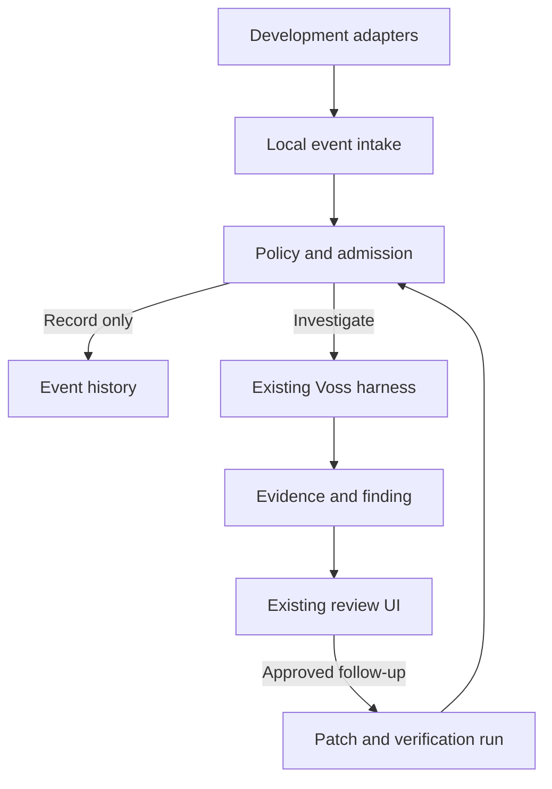

> **Reconciliation header (2026-09-05).** This is the brief as received, copied for reference. The executable plan is `.planning/CANVAS-OBSERVE-INSTRUCTIONS-PLAN.md`; where the two differ, the plan wins. Changes applied in the plan:
>
> 1. **Envelope unified with BOS3** (`.planning/BOS-EVENT-SCHEMA.md`): Observe events are a BOS category; findings are BOS4 decisions; dismiss/resolve are BOS5 outcome labels. OBS-03's envelope is a mapping, not a second schema.
> 2. **First adapter is the Voss PTY via OSC 133/OSC 7 in `crates/voss-app-core/src/pty/reader.rs`.** Warp is backlog. The "works in Warp" line in §12 does not apply.
> 3. **Provider billing flag.** Subscription-backed providers (`--auth=claude`, `--auth=codex`) are flat-rate: admission uses call/token/time limits, not the "unknown price disables admission" rule in OBS-04.
> 4. **Findings render as canvas nodes** beside the failing terminal, not as a separate Observe portal surface (OBS-09). Enrollment/pause live in Settings; events in a drawer.
> 5. `apps/voss-app/src/orchestration/OrchestrationConsole.tsx` landed on `dev` after this brief's baseline was inspected against a stale snapshot; it exists on `master` now. The in-app live wiring is `src/app/liveBoot.ts` + `src/org/live/*` + `src/portal/PortalShell.tsx`.
> 6. `plan` mode prompts for writes; it does not deny them. A fourth mode `observe` is added to `voss/harness/permissions.py`.
> 7. §9 Laravel is covered by `.planning/notes/laravel-account-control-plane-plan.md`.

# Voss Observe: Implementation Brief

Status: Proposed implementation specification  
Prepared: 2026-09-05  
Suggested repository location: `.planning/VOSS-OBSERVE-IMPLEMENTATION-BRIEF.md`  
Baseline: `voss-lang/voss`, `master`, commit `a6313d48b013fb8ec25f46bc721cbe7ef596984a`  
Scope: Add proactive development-event investigation to the existing Voss application and harness.

## 1. Product decision

Build **Voss Observe** as a capability within Voss. A developer enables observation for a repository, continues working in Voss's terminal (Warp support is backlog; *reconciled 2026-09-05*), and receives evidence-backed findings when a meaningful development event warrants investigation.

The product should answer:

> What happened, what likely caused it, what evidence supports that explanation, and what should I do next?

Preserve the existing desktop, Python harness, tools, permissions, memory, and review machinery. Add event capture, selective investigation scheduling, and actionable findings around those foundations. Do not create a second agent platform or fork the repository for this work.

### Intended experience

1. The developer enables Observe for a trusted repository and selects its model/data-sharing settings.
2. An instrumented command, such as `pnpm test`, fails.
3. Voss records the command identity, working directory, exit status, available output, and repository state.
4. Local rules determine whether an investigation is useful and permitted.
5. One investigator uses the existing harness to inspect relevant evidence and repository context.
6. It requests specialist help only when necessary and within the same capability and spending limits.
7. A finding appears with supporting evidence, affected files, uncertainty, and actions.
8. Later phases allow proposing a patch, reviewing it, approving its application, and verifying the result.

An ordinary failure may produce a useful finding from one agent. Agent count is not a success metric.

## 2. Evidence and implementation status

This brief derives from a source inspection of the baseline commit, plus the supplied Forge concept. It is not a claim that the existing desktop or every runtime path has passed end-to-end validation. The supplied Repomix snapshot predates significant live-repository additions.

Treat existing paths below as integration anchors. Treat all proposed files, endpoints, schemas, defaults, and acceptance tests in this brief as new requirements until implemented. Before coding, compare the working branch with the pinned baseline and inspect applicable repository instructions. Reconcile changed interfaces rather than restoring older code to match this document.

### Existing foundations

| Capability | Baseline evidence | Implication |
| --- | --- | --- |
| Desktop | `apps/voss-app/package.json` uses Tauri, SolidJS, and TypeScript | Extend SolidJS; do not introduce React |
| Orchestration console | *Historical anchor; the file does not exist on `dev`.* Live wiring is `apps/voss-app/src/App.tsx` + `src/org/live/*` + `src/portal/PortalShell.tsx` (*reconciled 2026-09-05*) | Reuse connection and run-inspection surfaces |
| Local sidecar supervision | `crates/voss-app-core/src/sidecar.rs` owns a Python `voss serve` process | Preserve the Rust-to-Python boundary |
| Runtime transport | `voss/harness/server/app.py` exposes sessions, messages, permissions, and swarm operations | Add Observe through this local service |
| PTY telemetry | `crates/voss-app-core/src/pty/commands.rs` exposes data, exit, foreground process, title, budget, and context events | Extend where useful; a shell exit is not an individual command completion |
| File observation | `voss/harness/watch/backend.py` debounces filesystem events and excludes harness cache writes | Reuse mechanics; add repository-level semantics |
| Delegation | `swarm_coordinator.py`, `swarm_runtime.py`, and `swarm_store.py` implement task decomposition and execution | Reuse applicable pieces without inheriting write-oriented behavior |
| Permissions and safety | `permissions.py` and `safety.py` provide mode, project-policy, and safety classification machinery | Compose an explicit Observe capability ceiling |
| Memory | `memory_store.py` provides recall, notes, conventions, and run records | Use relevant memory from the first investigation |
| Engineering records | `bos_events.py`, `bos_ledger.py`, and `bos_decisions.py` provide projections and ledgers | Preserve their semantics and record causal links |
| Replay | `swarm_store.py` reconstructs swarm state from events | Reuse concepts; replay does not itself resume interrupted execution safely |

### Known integration risks

- The active desktop orchestration path uses the Python harness. Replacing it with a Rust orchestrator would expand this project into a migration.
- The existing CLI swarm runtime can commit member work to candidate branches. Automatic Observe investigations must never invoke this behavior.
- External CLI ownership enforcement is described in that runtime as post-exit reconciliation. This does not guarantee read-only execution.
- The inspected server permission constructor passes a swarm policy. Full repository permission/safety resolution must be verified across the new call path; the presence of a policy module is insufficient evidence of enforcement.
- Existing engineering-event projections reconstruct facts from records. They must not be mistaken for a live, durable trigger scheduler.
- No complete external Warp command-capture adapter or implemented Laravel service was established by the inspection.

## 3. Goals and non-goals

### Goals

- Investigate relevant failures without requiring repeated prompts.
- Explain findings through concrete, inspectable evidence.
- Preserve developer control over execution and changes.
- Work without a Laravel connection or cloud account.
- Share one orchestration, tool, permission, and memory foundation with existing Voss features.
- Keep automatic activity bounded, quiet, and easy to disable.
- Support multiple development environments through normalized events.

### Non-goals for the initial release

- Replacing Warp or building a new terminal application.
- Rewriting the Python harness in Rust.
- A general-purpose workflow graph engine or new orchestration DSL.
- Unattended code changes, commits, pushes, deployments, or repository repair.
- Launching unrestricted external CLI agents for automatic investigation.
- Accessibility or screen scraping as the primary observation mechanism.
- Full offline model inference unless a suitable local provider is configured.
- Laravel authentication, billing, team administration, or cross-device synchronization as a prerequisite.

Local-first means observation, state, policy decisions, and tool execution remain local. If a remote model is selected, permitted code context is sent to that provider. This is distinct from optional cloud-history synchronization.

## 4. Architecture and ownership

| Component | Owns | Must not own |
| --- | --- | --- |
| Rust/Tauri host | Desktop lifecycle, adapter supervision, local ingress boundary, PTY/process integration | A duplicate model loop or independent tool-permission policy |
| Python Observe module | Event normalization, admission decisions, queue, investigations, findings | Desktop-specific assumptions or cloud requirements |
| Existing Voss harness | Models, tools, scoped context, delegation, policy checks, run records | Implicitly elevating an automatic investigation to an editing run |
| SolidJS UI | Repository enablement, event list, findings, run links, settings, actions | Deciding whether a backend operation is authorized |
| Laravel, later | Accounts, devices, versioned configuration, team policy distribution, optional metadata | Direct execution of local commands or mandatory routing of model calls |

### Event and investigation flow



Every step preserves `event_id`, `investigation_id`, and the existing run identifier when available. Follow-up execution produces attributed events and must not recursively trigger fresh investigations by default.

### Proposed integration locations

These names are suggestions, not existing interfaces or a mandate to create one file per row.

| Location | Proposed responsibility |
| --- | --- |
| `voss/harness/observe/` | Domain models, ingestion, admission, queue, persistence, investigation service |
| `voss/harness/server/` | Thin Observe routes using existing authentication and transport conventions |
| `crates/voss-app-core/src/observe/` | Adapter lifecycle and protected local ingress, if Rust ownership is selected in the spike |
| `apps/voss-app/src/surfaces/observe/` | Events and findings UI following existing surface conventions |
| `contracts/observe-*.schema.json` | Versioned cross-language contracts, following current schema generation conventions |
| `tests/harness/observe/` | Deterministic admission, capability, persistence, and investigation tests |
| Existing desktop test locations | UI states and end-to-end connection coverage |

Inspect the current SDK/schema generation workflow before adding hand-maintained TypeScript or Rust duplicates. Reuse generated clients where supported.

## 5. Functional requirements

### OBS-01: Repository enrollment and trust

- Observe is disabled by default for each repository.
- Enabling it displays capture scope, model provider, permitted context sharing, and automatic spending limits.
- Repository identity includes canonical root and worktree identity. Branch name alone is insufficient.
- Repositories in different worktrees must not share active findings accidentally.
- Repository configuration may narrow capabilities. A checked-in file cannot grant execution or remote disclosure merely by being opened.
- Pause supports one repository or all observation. Disabling capture prevents new evidence collection; pausing analysis can leave capture enabled if the UI clearly says so.
- Revoking trust stops new investigations and cancels active automatic work cooperatively.

Acceptance: Opening a new clone does not initiate capture, a model call, or an agent run until enrollment is completed.

### OBS-02: Development adapters

Use a capability-based adapter contract. Report support for command start, command completion, output capture, repository context, process lifecycle, and origin attribution separately.

Initial discovery must compare:

1. ~~A structured shell integration running inside Warp.~~ *Backlog (reconciled 2026-09-05).*
2. ~~Explicit command wrapping for dependable output capture.~~ *Not needed for the PTY path.*
3. Voss-owned PTY integration for commands launched in the existing desktop. **Selected first adapter**: OSC 133/OSC 7 markers emitted by `voss shell-init`, parsed in `crates/voss-app-core/src/pty/reader.rs`.

~~The initial supported path may be an explicit wrapper if passive integration cannot capture sufficient evidence reliably. Label partial support; do not imply complete Warp observation.~~

Requirements:

- Correlate start/completion through stable command and shell-session IDs.
- Preserve the command's exit status and normal developer interaction.
- Do not block the shell on a model call or unavailable service.
- Bound any local delivery buffer and record dropped events.
- Capture output only through a proven, explicit mechanism. Shell lifecycle hooks alone are not proof of stdout/stderr capture.
- Track output completeness, truncation, and capture method.
- Treat pipelines, background jobs, and nested shells as explicit compatibility cases.
- Observe processes within the declared scope. Do not promise visibility into every subprocess of an external terminal.

Acceptance: A supported failed test command produces the correct cwd, command ID, exit status, and useful error excerpt. Adapter disconnection does not prevent the command from finishing.

### OBS-03: Normalize and validate events

Required envelope fields:

| Field | Meaning |
| --- | --- |
| `schema_version` | Contract version |
| `event_id` | Stable identity for idempotent ingestion |
| `event_type` | Typed event name |
| `occurred_at`, `received_at` | Source and intake timestamps |
| `repository_id`, `worktree_id` | Local repository association |
| `adapter_id`, `adapter_session_id` | Capture source and session |
| `command_id` | Command correlation, nullable for non-command events |
| `origin` | Developer, Voss, external agent, or unknown |
| `caused_by_event_id`, `run_id` | Causal linkage where established |
| `repository_state_id` | Captured code-state reference or explicit unavailable marker |
| `payload` | Validated event-specific data |
| `evidence_refs` | Local references to permitted captured evidence |

Initial event types: `command.started`, `command.completed`, and derived `command.failed` or `test.failed`. Add `git.diff.changed` and `git.branch.changed` after command investigation works.

Derived failure events reference the original command event. The same failing test must not schedule both a generic failure investigation and a test investigation. Do not infer that every nonzero exit is a defect. For example, a search command finding no matches can be expected behavior.

Reject malformed payloads, out-of-scope repository claims, excessive sizes, and unsupported major schema versions. Treat command/output text as untrusted evidence, never executable instructions.

### OBS-04: Admission, deduplication, and budgets

Admission is deterministic before optional model classification. Its outcome is `record_only`, `suppress`, `queue`, or `reject`, with a reason code and applicable policy version.

Initial defaults, adjustable after dogfooding:

| Setting | Initial behavior |
| --- | --- |
| Concurrent investigations | One per worktree, two per device |
| Queue | At most ten pending investigations per worktree; coalesce duplicates |
| Repeat-failure cooldown | Sixty seconds for equivalent evidence on unchanged code |
| Automatic investigation timeout | Ninety seconds |
| Model-call budget | At most four calls across the investigator and any specialists |
| Token budget | At most 60,000 prompt + completion tokens per investigation, investigator and specialist summed, reserved on the session `token_budget` (*reconciled 2026-09-05*; this is the "token" limit subscription sources admit on) |
| Agent budget | One investigator and at most one specialist |
| Output capture | At most 256 KiB per command, with explicit truncation |
| Spending | *Reconciled 2026-09-05:* for `metered` and `unknown` sources, automatic analysis remains off until a user-visible finite `budget_usd` is selected. For `subscription` sources (`claude-agent`, `codex-oauth`, or `[billing]` override) no dollar budget is required; admission uses the call, token, and time limits in this table. |

Fingerprint failures using repository/worktree, command identity, normalized error signature, and relevant code state. Do not normalize away diagnostic distinctions. Preserve the original evidence separately.

Unknown model pricing must not imply zero cost. Apply token, call, and time limits regardless; disable cost-dependent automatic admission when a required price estimate is unavailable **and the source is not flagged `subscription`** (*reconciled 2026-09-05*). Reserve budget before concurrent work and reconcile actual usage afterward. Report approximate costs as estimates; a dollar estimate is not an absolute billing guarantee.

Events from Voss verification are attached to the initiating run and suppressed from new automatic investigation unless an explicit bounded follow-up rule permits it. Unknown-origin events remain subject to cooldowns and loop limits.

Acceptance: Replaying the same event, or receiving generic and classified forms of the same failure, produces at most one investigation. Budget exhaustion records a reason and makes no additional model call.

### OBS-05: Repository-state-aware context

- Use the existing repository tools and memory retrieval.
- Begin with failed output, named files, related definitions, and relevant conventions.
- Avoid loading the entire repository by default.
- Capture HEAD, worktree identity, and a content-sensitive fingerprint of the relevant tracked changes and permitted untracked files.
- Associate every quoted file excerpt with its content hash or equivalent state reference.
- If files change during retrieval, retry within a small bound or mark the evidence as mixed/stale. Never claim an atomic snapshot without actually capturing one.
- Re-check relevant state before publishing findings and before follow-up actions.
- A branch/worktree change invalidates the corresponding active context.
- Excluded paths must remain excluded from search, memory-derived excerpts, output enrichment, and provider payloads.

Acceptance: A diagnosis produced against an earlier file version is labeled stale after that file changes, and cannot silently become the basis of an applied patch.

### OBS-06: Investigation using the existing harness

Introduce an explicit `observe` run purpose or equivalent typed capability profile. Do not overload the existing interactive `plan` mode if that mode can ask to perform writes or shell execution.

An investigation receives the validated event, authorized evidence references, repository state, limits, and allowed tools. Its job is to distinguish observations from hypotheses, retrieve targeted context, and produce a structured result.

Default role: failure investigator. Optional specialist roles: repository-pattern analyst or independent reviewer. These are role configurations over shared runtime behavior, not separate model clients or bespoke agent loops.

Request specialist help only for a stated question that cannot be answered efficiently by the investigator. Delegate the same capability ceiling, context restrictions, cancellation signal, and remaining budget.

The first version uses native Voss agents only. Enabling external CLI agents requires a separately verified execution boundary; post-hoc write reversal is not an acceptable read-only guarantee.

Acceptance: A stub-provider investigation can follow captured failure output to a relevant symbol, cite an excerpt, and return an uncertainty-aware finding without modifying the repository or invoking shell execution.

### OBS-07: Enforced capabilities

The effective permission is the intersection of device trust, repository restrictions, session mode, Observe limits, and any later organization restrictions. Deny wins. UI settings and model prompts cannot widen the backend capability ceiling.

| Operation | Automatic investigation | Explicit follow-up |
| --- | --- | --- |
| Read/search permitted files | Allowed | Same scope unless separately authorized |
| Read status/diff and authorized memory | Allowed | Allowed |
| Send context to selected provider | Only within enrollment disclosure policy | Same disclosure policy |
| Run tests, lint, typecheck | Disabled initially | Approve concrete command and execution environment |
| Arbitrary shell or arbitrary network requests | Denied | Separate policy and approval |
| Generate patch content in Voss state | Deferred until proposal phase | Allowed by proposal action |
| Apply patch to project | Denied | Explicit approval bound to exact patch and state |
| Git commits, pushes, merges | Denied | Outside this brief's Observe flow |

Read-only refers to the observed project. Voss may write its own bounded local events, findings, and runtime records. These writes must be attributed and excluded from development triggers.

Audit indirect write paths: background tools, batch edits, custom tools, CLI launchers, worktree creation, candidate commits, and orchestration helpers. Do not route Observe into the existing write-oriented swarm path without removing these capabilities from that route.

Tests and lint are execution, not inherently read-only actions. Approval must identify cwd, argv, relevant environment, and state; apply time/output limits and an appropriate execution boundary. Starting a configured script must not authorize unrelated subsequent commands.

### OBS-08: Findings and lifecycle

Each finding contains:

- Stable ID, repository/worktree, triggering events, investigation ID, and existing run ID.
- A short title and plain-language explanation.
- Observed facts, suspected cause, alternatives, and missing evidence.
- Affected files with content-state references.
- Evidence references linking command output, file excerpts, and relevant remembered conventions.
- Confidence label with reasons, not an unsupported numeric certainty.
- Impact and verification status as separate fields.
- Suggested next action and applicable permission requirements.
- Creation/update times, code-state reference, and user feedback.

Store lifecycle status (`new`, `inspected`, `dismissed`, `resolved`) separately from freshness (`current`, `stale`) and verification (`unverified`, `passed`, `failed`, `inconclusive`). Inspecting a finding does not verify it. A successful unrelated test does not resolve it.

Incomplete output should yield a request for evidence or an inconclusive finding, not an invented explanation. Avoid promoting model hypotheses into durable repository conventions automatically.

### OBS-09: Desktop experience

Add an Observe surface using current SolidJS patterns. Reuse existing run inspection and review components where their semantics match.

Required UI states:

- Disabled, setup incomplete, enabled, paused, and adapter disconnected.
- Capture active but analysis paused.
- No events yet; recorded/suppressed event with reason.
- Queued, investigating, completed, cancelled, and interrupted.
- Model unavailable, budget exhausted, incomplete evidence, and stale finding.
- Finding inspected, dismissed, resolved, or awaiting approved follow-up.

Each finding offers Inspect Evidence, Open Run, Dismiss, and Reinvestigate when permitted. Proposal and verification actions appear only when implemented. Evidence links must not silently rerun commands.

Default notifications should be quiet: surface findings in the app, coalesce updates, and reserve desktop notifications for configured high-value events. Do not notify for every file change or terminal failure.

### OBS-10: Local persistence and recovery

Persist new Observe domain state without duplicating existing run history. Suggested entities are repository enrollment, captured events, evidence metadata, admission decisions, investigations, and findings. Existing run IDs remain authoritative for harness execution details.

For the first implementation, prefer a small transactional SQLite Observe store in Voss's application-state directory, keyed by repository/worktree, after checking current storage conventions. Keep existing session, swarm, memory, and BOS formats intact. Record this choice in an ADR before adding migrations.

Requirements:

- Unique constraints or equivalent atomic checks for event and investigation deduplication.
- Durable queue insertion before acknowledging admitted work.
- Bounded local evidence with explicit retention and schema migrations.
- Recovery marks previously running investigations interrupted, re-checks state and permissions, then permits a fresh read-only attempt with a linked attempt ID.
- Pending patch approvals expire after interruption or relevant code/policy change.
- Never automatically replay an uncertain side-effecting operation.
- Closing the desktop stops its owned observer/sidecar initially. Background menu-bar or daemon behavior is a later explicit lifecycle decision.

Replay of records, retry of analysis, and resumption of execution must be distinct operations in code and UI.

## 6. Proposed service boundary

Follow existing authenticated REST/SSE and client-generation conventions. These route names are illustrative and need reconciliation with current API conventions.

| Operation | Proposed endpoint | Semantics |
| --- | --- | --- |
| Ingest event | `POST /observe/events` | Validate and persist; return admission result without waiting for analysis |
| List events | `GET /observe/events` | Repository-scoped cursor pagination |
| Read settings | `GET /observe/settings` | Effective settings and restrictions |
| Update enrollment/settings | `PATCH /observe/settings` | Device/user-controlled action, never an event-supplied policy change |
| List findings | `GET /observe/findings` | Scope and lifecycle filters |
| Read finding | `GET /observe/findings/{id}` | Evidence references and linked run |
| Update finding | `PATCH /observe/findings/{id}` | Validated inspect/dismiss/resolve transitions |
| Investigate explicitly | `POST /observe/investigations` | Policy-checked request with idempotency key |
| Cancel investigation | `POST /observe/investigations/{id}/cancel` | Cooperative cancellation |

Reuse existing event transport where practical. If the current stream is session-scoped, add a repository-scoped Observe stream with sequence cursors rather than requiring a fabricated chat session for every capture event.

Adapter credentials must be restricted to event submission. Do not put a general sidecar control token into command arguments, checked-in shell scripts, or event payloads. A user-owned local socket or equivalent protected ingress is appropriate; select its exact implementation during the adapter spike. Validate scope even for authenticated events.

## 7. Configuration and privacy

Add to Voss configuration conventions, not a parallel `.forge/` directory. Proposed repository file: `.voss/observe.yml`.

Example only; this schema does not exist yet:

```yaml
version: 1
observe:
  commands:
    test:
      argv: [pnpm, test]
      failure_kind: test.failed
  exclude_paths:
    - .env
    - .env.*
    - node_modules/**
    - .git/**
  capture:
    max_output_bytes: 262144
  investigation:
    max_model_calls: 4
    timeout_seconds: 90
    max_specialists: 1
```

Enrollment, credentials, provider-disclosure consent, and granted execution permissions belong in device-controlled settings. Repository files express preferences or tighter restrictions; they cannot enable observation or authorize provider disclosure by themselves.

Command matching must follow structured invocation data where available. Do not implement a broad prefix allow rule that accepts `pnpm test; other-command` as an approved test invocation. If raw shell text is necessary, retain its interpreter context and do not automatically execute it as a typed command.

Separate controls for:

1. Local capture and retention.
2. Context sent to an explicitly selected model provider.
3. Optional future cloud metadata synchronization.

Bound captured data, redact known secret patterns before durable storage/provider use where feasible, and make exclusions configurable. Redaction is best effort, not proof that arbitrary terminal output is safe. A repository requiring stronger confidentiality must be able to disable output capture or remote analysis entirely.

Initial retention proposal: captured output seven days; events/findings thirty days; explicit user deletion available. Existing harness run retention is governed separately and must be disclosed. Deleting an Observe evidence record must not leave a hidden duplicate created by the new feature; identify references or copies in linked run records during implementation.

## 8. Patch proposal and verification, after the MVP

Selecting Propose Fix creates a linked proposal run. It does not authorize modifying the working tree.

- Produce a structured patch artifact in Voss-owned state.
- Reuse existing review machinery, with an independent review when the change warrants it.
- Bind approval to patch digest, repository/worktree, relevant base-file hashes, and effective policy version.
- Re-check these immediately before application. Reject stale approvals and request a refreshed proposal.
- Apply through existing tools and permissions; account for new/deleted files and partial-application failure.
- Never overwrite newer developer changes to make a patch fit.
- Approve verification commands separately unless the user explicitly approved a concrete combined apply-and-verify action.
- Link verification output to the proposal and originating finding; suppress recursive triggers.
- Mark resolved only through relevant successful verification or an explicit user resolution labeled as such.

Existing local candidate commits are outside this path. If a future design chooses candidate branches, that is a separate explicitly authorized capability with corresponding requirements.

## 9. Laravel cloud phase

Laravel remains part of the longer-term architecture, introduced after the local investigation loop proves useful.

### Initial cloud scope

- User authentication and registered devices.
- Versioned agent preferences and Observe configuration.
- Optional synchronization of allowlisted run metadata.
- Later organization membership and mandatory policy distribution.

Raw source, command output, prompts, patches, local paths, and credentials are not included in metadata sync by default. Use pseudonymous local repository identifiers unless the user explicitly chooses otherwise.

The desktop/harness calls model providers directly according to local settings. Laravel availability must not determine whether locally permitted observation works.

### Required sync semantics

- Version configuration updates and detect conflicts; do not silently overwrite local changes.
- Distribute policy through authenticated, integrity-protected updates and cache the last accepted version.
- Local restrictions may be stricter. Neither local preferences nor downloaded workflows may bypass a mandatory organization restriction.
- Define offline validity for mandatory team policies. When required policy validity expires, suspend affected automatic execution instead of silently relaxing it; local event viewing remains available.
- Keep API keys in established local credential storage. Sync provider selection, not secret values, initially.
- Persist metadata upload checkpoints with idempotency and retry limits.

Billing, shared workflow marketplaces, and remote task dispatch are separate future scopes. Choose Laravel deployment and API details when this phase is approved; they are not blockers for Phase 1.

## 10. Delivery plan and PR-sized work

Phases are dependency-ordered, not calendar estimates. Every implementation PR should explain the existing code reused, changed behavior, tests, and remaining gaps.

### Phase 0: Validate integration boundaries

**PR 0A: Architecture and compatibility ADRs**

- Re-check baseline paths against the working branch.
- Trace desktop-to-server-to-harness execution and full permission construction.
- Identify existing schema/client generation and storage conventions.
- Record the Observe capability ceiling and why the generic CLI swarm path is excluded.

**PR 0B: Adapter feasibility spike**

- Demonstrate one failed command in Warp using a structured integration or explicit wrapper.
- Verify output, exit code, pipeline behavior, cwd, disconnection, and normal shell interaction.
- Report supported/unsupported cases and choose the first supported adapter path.

Exit gate: A real failure reaches a local test receiver with useful evidence, and the architecture specifies the actual capture mechanism. Do not build a polished findings UI before this is proven.

### Phase 1: Observe and record

**PR 1A: Contracts, store, and authenticated ingestion**

- Versioned event models, scope validation, local persistence, deduplication, and evidence bounds.
- Unit tests for malformed input, duplicate delivery, and cross-repository rejection.

**PR 1B: Supported adapter and repository enrollment**

- Enable/disable flow, protected adapter transport, capture settings, health state, and nonblocking delivery.
- No model calls in this PR.

**PR 1C: Event surface**

- Repository-scoped events, evidence inspection, adapter status, and pause controls.

Exit gate: A developer can capture and inspect a supported failed command while Voss leaves the project untouched.

### Phase 2: Automatic read-only investigation MVP

**PR 2A: Capability enforcement and admission**

- Observe tool profile, policy intersection, rate limits, queue, cancellation, and causal suppression.
- Tests proving shell, writes, commits, and unsafe delegation cannot be reached.

**PR 2B: Investigator and finding contract**

- Existing harness integration, targeted evidence/memory retrieval, structured findings, and bounded optional specialist.
- Tests against curated failure fixtures and incomplete evidence.

**PR 2C: Findings experience**

- Finding lifecycle, freshness, run links, dismissal feedback, and spending visibility.
- Deterministic end-to-end test from captured failure to finding.

Exit gate: Observe automatically explains representative supported failures with evidence, does not modify project files, and handles duplicates, unavailable models, and exhausted budgets correctly.

### Phase 3: Expand signals and propose fixes

**PR 3A: Repository change signals**

- Diff fingerprints, branch changes, coalescing, stale finding handling, and bounded diff review.
- Filesystem activity becomes a trigger only after meaningful repository-state comparison.

**PR 3B: Patch proposal and review**

- Linked patch artifacts and existing review UI integration.

**PR 3C: Approved application and verification**

- Approval binding, stale-state rejection, safe application failure handling, and relevant verification links.

Exit gate: A user can review and approve a fix with no silent overwrite or implicit commit, and see whether the relevant verification actually passed.

### Phase 4: Reliability and measured usefulness

- Restart recovery, interrupted-attempt records, policy/approval expiry, retention cleanup, and transport reconnection.
- Broader adapter compatibility and overnight idle/resource checks.
- Improve routing using measured outcomes while keeping safety/admission deterministic.

Exit gate: Restart, duplicate delivery, and code churn do not cause duplicate work or repeated side effects. Resource use is acceptable during normal development.

### Phase 5: Laravel collaboration

- Authentication/devices, versioned config sync, conflict handling, optional metadata, and team-policy enforcement.
- Verify local operation without Laravel and restrictions under expired mandatory policy.

Exit gate: Cloud services add portability and collaboration without becoming the local execution owner.

## 11. Validation matrix

Use stub providers and fake adapters for deterministic tests, plus a small set of real adapter acceptance checks. Do not infer runtime guarantees solely from snapshots or source presence.

| Scenario | Required result |
| --- | --- |
| Failed supported test command | One investigation and evidence-backed finding |
| Same event delivered twice | One persisted event identity and no duplicate investigation |
| Generic failure plus derived test failure | One causal investigation |
| Expected nonzero command | Recorded or suppressed without automatic diagnosis |
| Failure output missing or truncated | Explicit evidence limitation; no fabricated stack trace |
| Command output contains instructions to modify files | Treated as data; capability ceiling remains enforced |
| Symlink or path escapes repository scope | Read rejected or resolved under explicit permitted scope |
| Observe agent requests write/shell/custom launcher | Backend denies it |
| Specialist requests wider capability | Backend denies it; inherited budget remains bounded |
| Verification produces another failure | Attached to original run; no unbounded trigger cycle |
| Worktree/branch changes during investigation | Cancelled or stale finding |
| Files change after patch approval | Application rejected pending refreshed review |
| App closes during investigation | Attempt recorded as interrupted on recovery |
| App closes after an uncertain apply | No blind reapplication; reconcile actual state |
| Provider fails or pricing unavailable | Clear state and bounded retry/admission behavior |
| Event flood | Bounded queue/evidence; visible dropped/coalesced counts |
| Laravel unavailable | Local permitted workflow continues |

### Evaluation fixtures and release targets

Build a small labeled set including changed response types, missing dependency/import, failed assertion, environment failure, expected nonzero exit, and insufficient evidence. Each fixture should identify known relevant evidence and acceptable uncertainty, rather than require one exact model sentence.

Initial product targets, to be calibrated rather than advertised as guarantees:

- No automatic project mutation across the capability test suite.
- No duplicate investigation in replay/idempotency cases.
- All findings expose evidence and the examined code state.
- At least 80% of curated diagnosable cases identify the relevant cause or file; inconclusive cases should explicitly abstain.
- Local event admission should remain fast independently of model latency; measure p95 and choose a release budget after the adapter spike.
- Track useful-finding feedback, dismissal reasons, cost per useful finding, time to finding, and idle resource use during dogfooding.

Record local evaluation results by default. Cloud analytics remain opt-in under the metadata policy.

## 12. Definition of done for the first useful release

- [ ] Existing Voss application and harness remain the implementation foundation.
- [ ] One supported command-capture path works in the Voss terminal with documented limitations (*reconciled 2026-09-05; Warp is backlog*).
- [ ] Repository enrollment and provider disclosure are explicit.
- [ ] Events include correct command, repository, output availability, and state references.
- [ ] Admission is deterministic, bounded, and idempotent.
- [ ] Native investigations use existing tools, permissions, and memory.
- [ ] Automatic investigations cannot write project files, run shell commands, or create commits.
- [ ] Findings show evidence, uncertainty, freshness, and a linked run.
- [ ] Pause, cancellation, disconnection, missing evidence, and budget exhaustion are visible.
- [ ] No Laravel connection is required.
- [ ] End-to-end fixture coverage and one real adapter walkthrough pass.
- [ ] Existing required repository checks pass; unrelated interfaces are not rewritten.

## 13. Build handoff

Start with Phase 0, then implement Phase 1 and Phase 2 as the first product milestone. Keep Phase 3 onward out of the initial branch unless necessary to satisfy a concrete dependency.

The first vertical slice is:

> A failed instrumented test command in a Voss terminal (*reconciled 2026-09-05*) produces a structured local event, then a read-only Voss investigation, then an evidence-backed finding in the existing desktop.

Before each PR, verify current repository instructions and inspect the relevant existing implementation. Do not assume proposed route names or filenames already exist. Do not launch the write-oriented swarm path to simulate an Observe investigation. Preserve current CLI and desktop behavior while the new capability remains disabled.

## 14. Source references

All links pin the reviewed baseline; they are evidence of inspected code, not a substitute for checking the implementation branch.

- [Desktop dependencies](https://github.com/voss-lang/voss/blob/a6313d48b013fb8ec25f46bc721cbe7ef596984a/apps/voss-app/package.json)
- ~~Orchestration console~~ *(historical; path does not exist on `dev`, see reconciliation header)*
- [Rust sidecar supervisor](https://github.com/voss-lang/voss/blob/a6313d48b013fb8ec25f46bc721cbe7ef596984a/crates/voss-app-core/src/sidecar.rs)
- [PTY events and commands](https://github.com/voss-lang/voss/blob/a6313d48b013fb8ec25f46bc721cbe7ef596984a/crates/voss-app-core/src/pty/commands.rs)
- [Harness server](https://github.com/voss-lang/voss/blob/a6313d48b013fb8ec25f46bc721cbe7ef596984a/voss/harness/server/app.py)
- [Agent loop](https://github.com/voss-lang/voss/blob/a6313d48b013fb8ec25f46bc721cbe7ef596984a/voss/harness/agent.py)
- [Permissions](https://github.com/voss-lang/voss/blob/a6313d48b013fb8ec25f46bc721cbe7ef596984a/voss/harness/permissions.py)
- [Safety classification](https://github.com/voss-lang/voss/blob/a6313d48b013fb8ec25f46bc721cbe7ef596984a/voss/harness/safety.py)
- [File watching](https://github.com/voss-lang/voss/blob/a6313d48b013fb8ec25f46bc721cbe7ef596984a/voss/harness/watch/backend.py)
- [Swarm coordinator](https://github.com/voss-lang/voss/blob/a6313d48b013fb8ec25f46bc721cbe7ef596984a/voss/harness/swarm_coordinator.py)
- [CLI swarm runtime](https://github.com/voss-lang/voss/blob/a6313d48b013fb8ec25f46bc721cbe7ef596984a/voss/harness/swarm_runtime.py)
- [Swarm store and replay](https://github.com/voss-lang/voss/blob/a6313d48b013fb8ec25f46bc721cbe7ef596984a/voss/harness/swarm_store.py)
- [Repository memory](https://github.com/voss-lang/voss/blob/a6313d48b013fb8ec25f46bc721cbe7ef596984a/voss/harness/memory_store.py)
- [Engineering-event projections](https://github.com/voss-lang/voss/blob/a6313d48b013fb8ec25f46bc721cbe7ef596984a/voss/harness/bos_events.py)
- [Decision ledger](https://github.com/voss-lang/voss/blob/a6313d48b013fb8ec25f46bc721cbe7ef596984a/voss/harness/bos_decisions.py)
